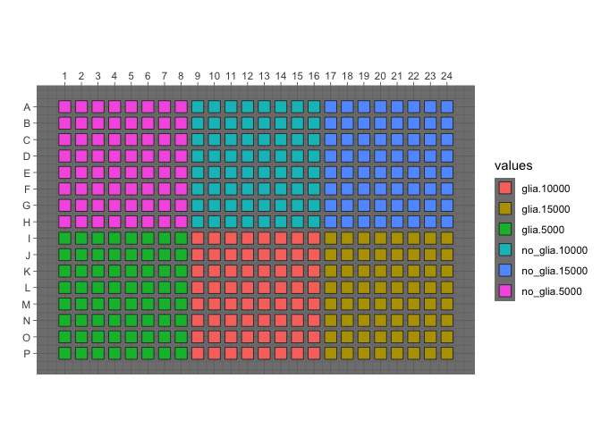

Sample wells
================

Select a few wells from each condition from the `CELLPAINTING` platemap.

``` r
library(magrittr)
library(tidyverse)
```

``` r
platemap <- read_tsv("metadata/platemaps/CELLPAINTING.txt")
```

    ## Parsed with column specification:
    ## cols(
    ##   plate_map_name = col_character(),
    ##   well_position = col_character(),
    ##   plating_density = col_double(),
    ##   condition = col_character()
    ## )

``` r
platemap %<>% mutate(condition_density = interaction(condition, plating_density))
```

Display the platemap

``` r
p <- 
  platetools::raw_map(data =
                      as.character(platemap$condition_density),
                      well = platemap$well_position,
                      plate = 384) +
  theme_dark() +
  scale_fill_discrete()

print(p)
```

<!-- -->
Sample a few wells (per condition) to analyze

``` r
platemap_reduced <- 
  platemap %>% 
  mutate(condition_density = 
    case_when(
      str_detect(well_position, "^C|^D|^L|^M") & str_detect(well_position, "04$|05$|12$|13$|20$|21$") ~ as.character(condition_density),
      TRUE ~ "0SKIP"
    )
    )

p <- 
  platetools::raw_map(
    data = as.character(platemap_reduced$condition_density),
    well = platemap_reduced$well_position,
    plate = 384) +
  theme_dark() +
  scale_fill_discrete()

print(p)
```

<!-- -->

Display list of wells

``` r
platemap_reduced %>% 
  filter(condition_density != "0SKIP") %>%
  select(well_position, plating_density, condition) %>%
  data.frame()
```

    ##    well_position plating_density condition
    ## 1            C04            5000   no_glia
    ## 2            C05            5000   no_glia
    ## 3            C12           10000   no_glia
    ## 4            C13           10000   no_glia
    ## 5            C20           15000   no_glia
    ## 6            C21           15000   no_glia
    ## 7            D04            5000   no_glia
    ## 8            D05            5000   no_glia
    ## 9            D12           10000   no_glia
    ## 10           D13           10000   no_glia
    ## 11           D20           15000   no_glia
    ## 12           D21           15000   no_glia
    ## 13           L04            5000      glia
    ## 14           L05            5000      glia
    ## 15           L12           10000      glia
    ## 16           L13           10000      glia
    ## 17           L20           15000      glia
    ## 18           L21           15000      glia
    ## 19           M04            5000      glia
    ## 20           M05            5000      glia
    ## 21           M12           10000      glia
    ## 22           M13           10000      glia
    ## 23           M20           15000      glia
    ## 24           M21           15000      glia

Make a list of corresponding images

``` r
load_data <- 
  read_csv("../../../load_data_csv/NCP_PILOT_1/BR00106976/load_data.csv") %>%
  select(-matches("Brightfield")) %>% 
  inner_join(platemap_reduced %>% 
               filter(condition_density != "0SKIP") %>% 
               select(well_position),
             by = c("Metadata_Well" = "well_position")) 
```

    ## Parsed with column specification:
    ## cols(
    ##   .default = col_double(),
    ##   FileName_OrigRNA = col_character(),
    ##   PathName_OrigRNA = col_character(),
    ##   FileName_OrigER = col_character(),
    ##   PathName_OrigER = col_character(),
    ##   FileName_OrigAGP = col_character(),
    ##   PathName_OrigAGP = col_character(),
    ##   FileName_OrigMito = col_character(),
    ##   PathName_OrigMito = col_character(),
    ##   FileName_OrigBrightfield = col_character(),
    ##   PathName_OrigBrightfield = col_character(),
    ##   FileName_OrigDNA = col_character(),
    ##   PathName_OrigDNA = col_character(),
    ##   Metadata_Plate = col_character(),
    ##   Metadata_Well = col_character(),
    ##   Metadata_AbsTime = col_datetime(format = ""),
    ##   Metadata_ChannelName = col_character()
    ## )

    ## See spec(...) for full column specifications.

``` r
load_data %>%
  write_csv("output/subset_BR00106975_load_data.csv")

load_data %>%
  mutate(PathName_OrigAGP  = str_replace(PathName_OrigAGP,  "/home/ubuntu/bucket", "s3://imaging-platform")) %>%
  mutate(PathName_OrigDNA  = str_replace(PathName_OrigDNA,  "/home/ubuntu/bucket", "s3://imaging-platform")) %>%
  mutate(PathName_OrigER   = str_replace(PathName_OrigER,   "/home/ubuntu/bucket", "s3://imaging-platform")) %>%
  mutate(PathName_OrigMito = str_replace(PathName_OrigMito, "/home/ubuntu/bucket", "s3://imaging-platform")) %>%
  mutate(PathName_OrigRNA  = str_replace(PathName_OrigRNA,  "/home/ubuntu/bucket", "s3://imaging-platform")) %>%
  mutate(S3_OrigAGP  = str_c(PathName_OrigAGP , "/", FileName_OrigAGP )) %>%
  mutate(S3_OrigDNA  = str_c(PathName_OrigDNA , "/", FileName_OrigDNA )) %>%
  mutate(S3_OrigER   = str_c(PathName_OrigER  , "/", FileName_OrigER  )) %>%
  mutate(S3_OrigMito = str_c(PathName_OrigMito, "/", FileName_OrigMito)) %>%
  mutate(S3_OrigRNA  = str_c(PathName_OrigRNA , "/", FileName_OrigRNA )) %>% 
  select(matches("^S3")) %>%
  gather(channel, s3loc) %>%
  select(s3loc) %>%
  write_tsv("output/subset_BR00106975_files.txt", col_names = FALSE)
```

Copy these files locally. Replace the paths below as
    appropriate.

    mkdir -p ~/work/projects/2019_05_28_Neuronal_Cell_Painting/NCP_PILOT_1/images/BR00106976__2019-08-26T17_45_18-Measurement_1/Images/
    parallel -a output/subset_BR00106975_files.txt aws s3 cp {1} ~/work/projects/2019_05_28_Neuronal_Cell_Painting/NCP_PILOT_1/images/BR00106976__2019-08-26T17_45_18-Measurement_1/Images/

Create a load data file with relative paths. When loading this in
CellProfiler, specify the `Base image location` as the project folder
i.e.
`~/work/projects/2019_05_28_Neuronal_Cell_Painting/`

``` r
project_base_path <- path.expand("~/work/projects/2019_05_28_Neuronal_Cell_Painting/")
  
read_csv("output/subset_BR00106975_load_data.csv") %>%
  mutate(PathName_OrigAGP  = str_replace(PathName_OrigAGP,  "/home/ubuntu/bucket/projects/2019_05_28_Neuronal_Cell_Painting/", project_base_path)) %>%
  mutate(PathName_OrigDNA  = str_replace(PathName_OrigDNA,  "/home/ubuntu/bucket/projects/2019_05_28_Neuronal_Cell_Painting/", project_base_path)) %>%
  mutate(PathName_OrigER   = str_replace(PathName_OrigER,   "/home/ubuntu/bucket/projects/2019_05_28_Neuronal_Cell_Painting/", project_base_path)) %>%
  mutate(PathName_OrigMito = str_replace(PathName_OrigMito, "/home/ubuntu/bucket/projects/2019_05_28_Neuronal_Cell_Painting/", project_base_path)) %>%
  mutate(PathName_OrigRNA  = str_replace(PathName_OrigRNA,  "/home/ubuntu/bucket/projects/2019_05_28_Neuronal_Cell_Painting/", project_base_path)) %>%
  write_csv(path.expand("~/Desktop/subset_BR00106975_load_data_local.csv"))
```

    ## Parsed with column specification:
    ## cols(
    ##   .default = col_double(),
    ##   FileName_OrigRNA = col_character(),
    ##   PathName_OrigRNA = col_character(),
    ##   FileName_OrigER = col_character(),
    ##   PathName_OrigER = col_character(),
    ##   FileName_OrigAGP = col_character(),
    ##   PathName_OrigAGP = col_character(),
    ##   FileName_OrigMito = col_character(),
    ##   PathName_OrigMito = col_character(),
    ##   FileName_OrigDNA = col_character(),
    ##   PathName_OrigDNA = col_character(),
    ##   Metadata_Plate = col_character(),
    ##   Metadata_Well = col_character(),
    ##   Metadata_AbsTime = col_datetime(format = ""),
    ##   Metadata_ChannelName = col_character()
    ## )

    ## See spec(...) for full column specifications.
