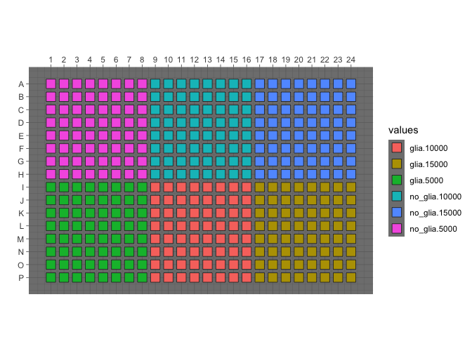
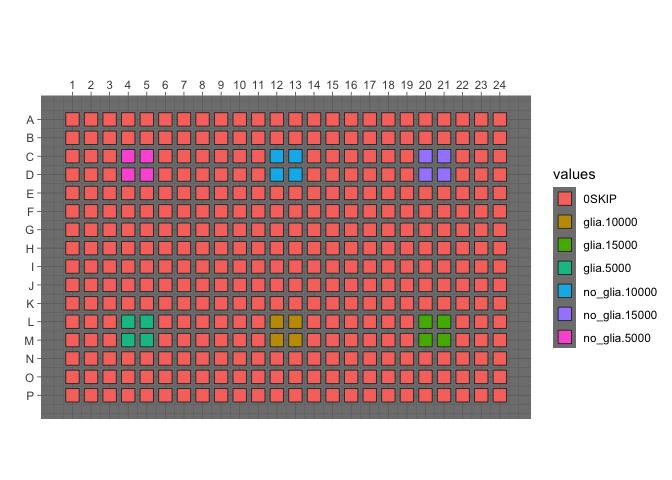

Sample wells
================

``` r
library(magrittr)
library(tidyverse)
```

``` r
platemap <- read_tsv("0.pilot-run-workflows/metadata/platemaps/CELLPAINTING.txt")
```

    ## Parsed with column specification:
    ## cols(
    ##   plate_map_name = col_character(),
    ##   well_position = col_character(),
    ##   plating_density = col_double(),
    ##   condition = col_character()
    ## )

``` r
platemap %<>% mutate(condition_density = interaction(condition, plating_density))
```

Display the platemap

``` r
p <- 
  platetools::raw_map(data =
                      as.character(platemap$condition_density),
                      well = platemap$well_position,
                      plate = 384) +
  theme_dark() +
  scale_fill_discrete()

print(p)
```

<!-- -->
Sample a few wells (per condition) to analyze

``` r
platemap_reduced <- 
  platemap %>% 
  mutate(condition_density = 
    case_when(
      str_detect(well_position, "^C|^D|^L|^M") & str_detect(well_position, "04$|05$|12$|13$|20$|21$") ~ as.character(condition_density),
      TRUE ~ "0SKIP"
    )
    )

p <- 
  platetools::raw_map(
    data = as.character(platemap_reduced$condition_density),
    well = platemap_reduced$well_position,
    plate = 384) +
  theme_dark() +
  scale_fill_discrete()

print(p)
```

<!-- -->
