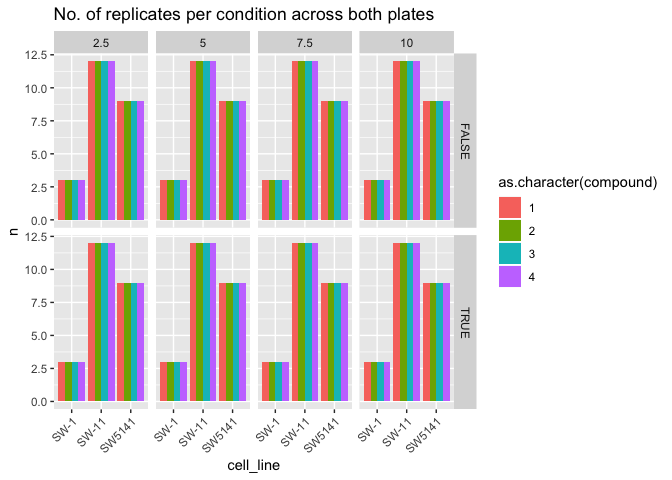

Design NCP Pilots
================

``` r
library(magrittr)
library(tidyverse)
```

``` r
plate1 <- tibble(
  row = rep(seq(1,16), 24),
  col = rep(seq(1, 24), each = 16),
  rowc = rep(LETTERS[1:16], 24),
  well = sprintf("%s%02d", rowc, col)
)

plate1 %<>%
  mutate(cell_line = 
           case_when(
             between(row, 1, 8) ~ "SW-11",
             between(row, 9, 16) & between(col, 1, 12) ~ "SW5141",
             between(row, 9, 16) & between(col, 13, 24) ~ "SW-1"
             )
         )

plate1 %<>%
  mutate(density = 
           case_when(
             row %in% c(1, 2, 9, 10) ~ 2.5,
             row %in% c(3, 4, 11, 12) ~ 5,
             row %in% c(5, 6, 13, 14) ~ 7.5,
             row %in% c(7, 8, 15, 16) ~ 10
             )
         )

plate1 %<>%
  mutate(gfp = col %% 2 == 1)

plate1 %<>%
  mutate(plate = "plate1")
```

``` r
plate2 <- tibble(
  row = rep(seq(1,16), 24),
  col = rep(seq(1, 24), each = 16),
  rowc = rep(LETTERS[1:16], 24),
  well = sprintf("%s%02d", rowc, col)
)

plate2 %<>%
  mutate(cell_line = 
           case_when(
             between(row, 1, 8) ~ "SW-11",
             between(row, 9, 16) ~ "SW5141"
             )
         )

plate2 %<>%
  mutate(density = 
           case_when(
             row %in% c(1, 2, 9, 10) ~ 2.5,
             row %in% c(3, 4, 11, 12) ~ 5,
             row %in% c(5, 6, 13, 14) ~ 7.5,
             row %in% c(7, 8, 15, 16) ~ 10
             )
         )

plate2 %<>%
  mutate(gfp = col %% 2 == 1)

plate2 %<>%
  mutate(plate = "plate2")
```

Display the platemap

``` r
p <- 
  platetools::raw_map(data =
                      as.character(plate1$cell_line),
                      well = plate1$well,
                      plate = 384) +
  theme_dark() +
  scale_fill_discrete()

print(p)
```

<!-- -->

``` r
p <- 
  platetools::raw_map(data =
                      as.character(plate1$gfp),
                      well = plate1$well,
                      plate = 384) +
  theme_dark() +
  scale_fill_discrete()

print(p)
```

<!-- -->

``` r
p <- 
  platetools::raw_map(data =
                      plate1$density,
                      well = plate1$well,
                      plate = 384) +
  theme_dark() +
  scale_fill_continuous()

print(p)
```

<!-- -->

``` r
plate1 %>% group_by(cell_line, gfp, density) %>% tally()
```

    ## # A tibble: 24 x 4
    ## # Groups:   cell_line, gfp [6]
    ##    cell_line gfp   density     n
    ##    <chr>     <lgl>   <dbl> <int>
    ##  1 SW-1      FALSE     2.5    12
    ##  2 SW-1      FALSE     5      12
    ##  3 SW-1      FALSE     7.5    12
    ##  4 SW-1      FALSE    10      12
    ##  5 SW-1      TRUE      2.5    12
    ##  6 SW-1      TRUE      5      12
    ##  7 SW-1      TRUE      7.5    12
    ##  8 SW-1      TRUE     10      12
    ##  9 SW-11     FALSE     2.5    24
    ## 10 SW-11     FALSE     5      24
    ## # … with 14 more rows

``` r
bind_rows(plate1, plate2) %>% group_by(cell_line, gfp, density) %>% tally()
```

    ## # A tibble: 24 x 4
    ## # Groups:   cell_line, gfp [6]
    ##    cell_line gfp   density     n
    ##    <chr>     <lgl>   <dbl> <int>
    ##  1 SW-1      FALSE     2.5    12
    ##  2 SW-1      FALSE     5      12
    ##  3 SW-1      FALSE     7.5    12
    ##  4 SW-1      FALSE    10      12
    ##  5 SW-1      TRUE      2.5    12
    ##  6 SW-1      TRUE      5      12
    ##  7 SW-1      TRUE      7.5    12
    ##  8 SW-1      TRUE     10      12
    ##  9 SW-11     FALSE     2.5    48
    ## 10 SW-11     FALSE     5      48
    ## # … with 14 more rows

``` r
sample_compounds <- function(n_wells, n_compounds) {
  stopifnot(!(n_wells %% n_compounds))
  n_reps <- n_wells / n_compounds
  sample(rep(seq(n_compounds), n_reps))
}

sample_compounds(12, 4)
```

    ##  [1] 4 4 4 1 1 3 3 2 1 3 2 2

``` r
plate1 %<>% 
  group_by(cell_line, gfp, density) %>% 
  mutate(compound = sample_compounds(n(), 4))

plate2 %<>% 
  group_by(cell_line, gfp, density) %>% 
  mutate(compound = sample_compounds(n(), 4))
```

``` r
bind_rows(plate1, plate2) %>% 
  group_by(cell_line, gfp, density, compound) %>% 
  tally() %>%
  ggplot(aes(cell_line, n, fill = as.character(compound))) + 
  geom_col(position = "dodge") + 
  facet_grid(gfp ~ density) +
  theme(axis.text.x = element_text(angle = 45, vjust = 1, hjust=1)) +
  ggtitle("No. of replicates per condition across both plates")
```

<!-- -->

``` r
p <- 
  platetools::raw_map(data =
                      as.character(plate1$compound),
                      well = plate1$well,
                      plate = 384) +
  theme_dark() +
  scale_fill_discrete()

print(p)
```

<!-- -->

``` r
p <- 
  platetools::raw_map(data =
                      as.character(plate2$compound),
                      well = plate2$well,
                      plate = 384) +
  theme_dark() +
  scale_fill_discrete()

print(p)
```

<!-- -->
