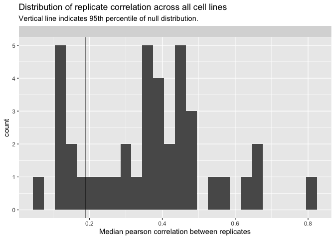
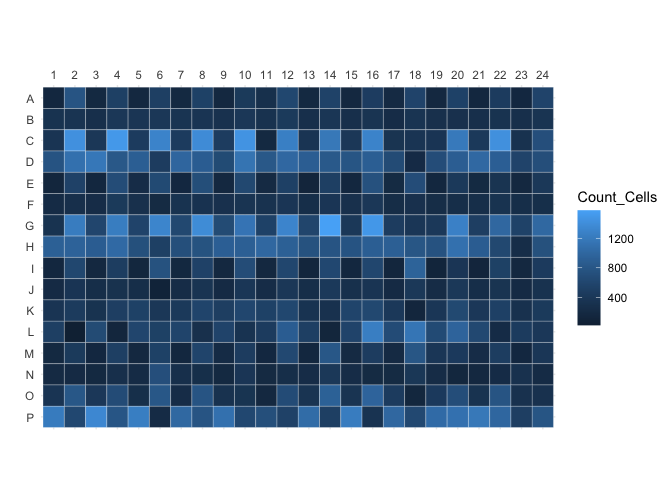
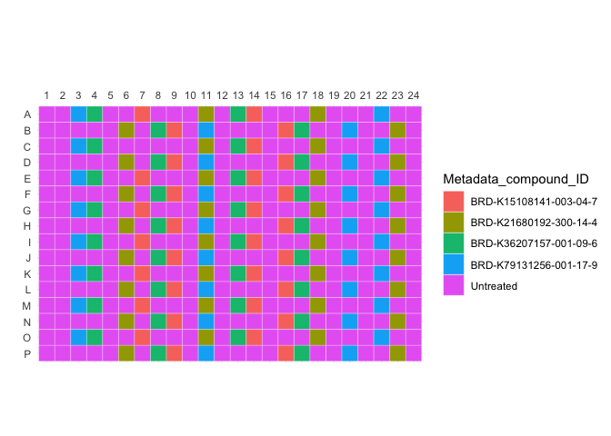
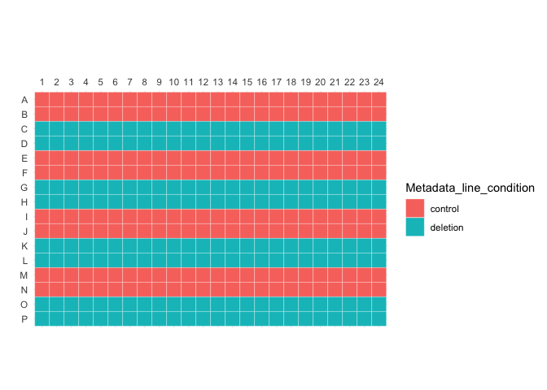
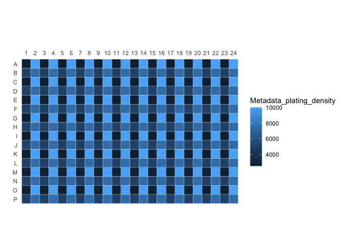
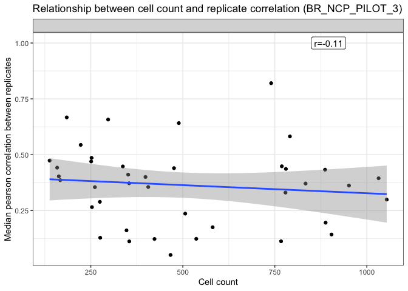
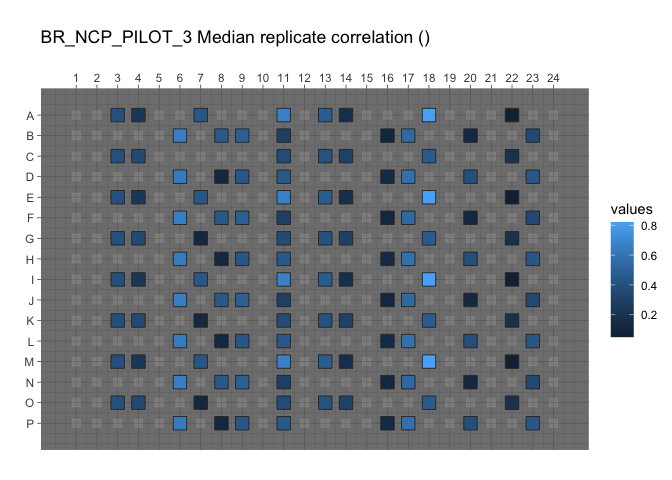
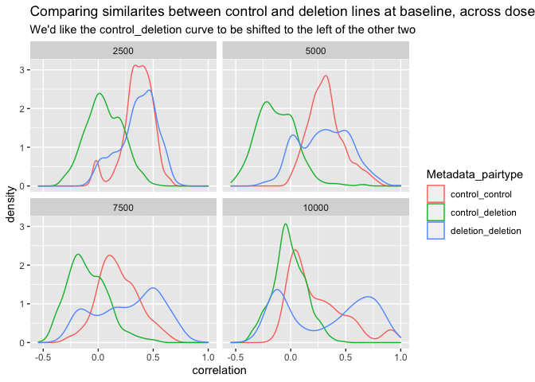
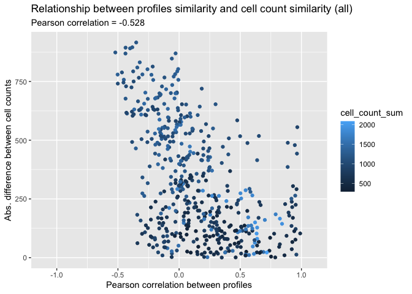

Inspect profiles
================
Shantanu Singh
Nov 2020

If running interactively in RStudio,

-   change `output` in the header of this markdown to `html_notebook`
    and
-   change to `eval=TRUE` below

When knitting for pushing to GitHub,

-   change `output` in the header of this markdown to `github_document`
    and
-   change to `eval=FALSE` below

``` r
show_table <- knitr::kable
```

## Load libraries

``` r
library(ggplot2)
library(glue)
library(magrittr)
library(tidyverse)
```

``` r
simple_aggregate <- function(population, variables, strata, operation="mean") {
  population %>%
    dplyr::group_by_at(.vars = strata) %>%
    dplyr::summarise_at(.funs = operation, .vars = variables) %>%
    dplyr::ungroup()
}
```

## Data overview

### Read profiles

``` r
batch_id <- "NCP_PILOT_3"

platemap <- "BR_NCP_PILOT_3"

plate_id <- "BR_NCP_PILOT_3"

profiles <- 
  read_csv(file.path("profiles", batch_id, plate_id, paste0(plate_id, "_normalized_variable_selected.csv.gz")), 
           progress = FALSE)
```

### Save profiles for grit

``` r
profiles %<>% 
  mutate(Metadata_compound_ID = 
           replace_na(Metadata_compound_ID, "Untreated"))

profiles %<>% 
  mutate(Metadata_group = 
           str_c(Metadata_line_condition, 
                 Metadata_plating_density, 
                 sep = "_")) %>%
  mutate(Metadata_replicate = Metadata_compound_ID)  
    
variables <- str_subset(names(profiles), "^Metadata_", negate = TRUE)

metadata <- str_subset(names(profiles), "^Metadata_", negate = FALSE)

profiles <- 
  bind_cols(
    select(profiles, all_of(metadata)), 
    select(profiles, all_of(variables))
    )

profiles %>%
  write_csv(file.path(
    "profiles",
    batch_id,
    plate_id,
    paste0(plate_id, "_normalized_variable_selected.csv.gz")
  ))
```

Report the size of feature spaces

``` r
tribble(~profile_type, ~feature_space,
        "all", length(variables)
) %>%
  show_table
```

| profile\_type | feature\_space |
|:--------------|---------------:|
| all           |            656 |

``` r
profiles %>% select(matches("Metadata_")) %>% 
  head() %>%
  show_table
```

| Metadata\_Plate   | Metadata\_Well | Metadata\_Assay\_Plate\_Barcode | Metadata\_Plate\_Map\_Name | Metadata\_well\_position | Metadata\_plating\_density | Metadata\_line\_condition | Metadata\_compound\_ID | Metadata\_replicate    | Metadata\_group |
|:------------------|:---------------|:--------------------------------|:---------------------------|:-------------------------|---------------------------:|:--------------------------|:-----------------------|:-----------------------|:----------------|
| BR\_NCP\_PILOT\_3 | A01            | BR\_NCP\_PILOT\_3               | BR\_NCP\_PILOT\_3          | A01                      |                       2500 | control                   | Untreated              | Untreated              | control\_2500   |
| BR\_NCP\_PILOT\_3 | A02            | BR\_NCP\_PILOT\_3               | BR\_NCP\_PILOT\_3          | A02                      |                      10000 | control                   | Untreated              | Untreated              | control\_10000  |
| BR\_NCP\_PILOT\_3 | A03            | BR\_NCP\_PILOT\_3               | BR\_NCP\_PILOT\_3          | A03                      |                       2500 | control                   | BRD-K79131256-001-17-9 | BRD-K79131256-001-17-9 | control\_2500   |
| BR\_NCP\_PILOT\_3 | A04            | BR\_NCP\_PILOT\_3               | BR\_NCP\_PILOT\_3          | A04                      |                      10000 | control                   | BRD-K36207157-001-09-6 | BRD-K36207157-001-09-6 | control\_10000  |
| BR\_NCP\_PILOT\_3 | A05            | BR\_NCP\_PILOT\_3               | BR\_NCP\_PILOT\_3          | A05                      |                       2500 | control                   | Untreated              | Untreated              | control\_2500   |
| BR\_NCP\_PILOT\_3 | A06            | BR\_NCP\_PILOT\_3               | BR\_NCP\_PILOT\_3          | A06                      |                      10000 | control                   | Untreated              | Untreated              | control\_10000  |

### How many replicates?

Report based on metadata

``` r
metadata <- read_tsv(file.path("metadata", batch_id, "platemap", paste0(platemap, ".txt")))
```

    ## 
    ## ── Column specification ────────────────────────────────────────────────────────
    ## cols(
    ##   plate_map_name = col_character(),
    ##   well_position = col_character(),
    ##   plating_density = col_double(),
    ##   line_condition = col_character(),
    ##   compound_ID = col_character()
    ## )

``` r
metadata %<>%
  rename(
  Metadata_Plate_Map_Name = plate_map_name,
  Metadata_Well = well_position,
  Metadata_plating_density = plating_density,
  Metadata_compound_ID = compound_ID,
  Metadata_line_condition = line_condition) %>%
  mutate(
    Metadata_Plate = "BR_NCP_PILOT_3"
  ) 

metadata %>% 
  group_by(Metadata_plating_density,
           Metadata_compound_ID,
           Metadata_line_condition) %>%
  tally() %>%
  show_table
```

| Metadata\_plating\_density | Metadata\_compound\_ID | Metadata\_line\_condition |   n |
|---------------------------:|:-----------------------|:--------------------------|----:|
|                       2500 | BRD-K15108141-003-04-7 | control                   |   4 |
|                       2500 | BRD-K15108141-003-04-7 | deletion                  |   3 |
|                       2500 | BRD-K21680192-300-14-4 | control                   |   4 |
|                       2500 | BRD-K21680192-300-14-4 | deletion                  |   4 |
|                       2500 | BRD-K36207157-001-09-6 | control                   |   4 |
|                       2500 | BRD-K36207157-001-09-6 | deletion                  |   4 |
|                       2500 | BRD-K79131256-001-17-9 | control                   |   4 |
|                       2500 | BRD-K79131256-001-17-9 | deletion                  |   4 |
|                       2500 | NA                     | control                   |  32 |
|                       2500 | NA                     | deletion                  |  33 |
|                       5000 | BRD-K15108141-003-04-7 | control                   |   4 |
|                       5000 | BRD-K15108141-003-04-7 | deletion                  |   4 |
|                       5000 | BRD-K21680192-300-14-4 | control                   |   4 |
|                       5000 | BRD-K21680192-300-14-4 | deletion                  |   4 |
|                       5000 | BRD-K36207157-001-09-6 | control                   |   4 |
|                       5000 | BRD-K36207157-001-09-6 | deletion                  |   4 |
|                       5000 | BRD-K79131256-001-17-9 | control                   |   4 |
|                       5000 | BRD-K79131256-001-17-9 | deletion                  |   4 |
|                       5000 | NA                     | control                   |  32 |
|                       5000 | NA                     | deletion                  |  32 |
|                       7500 | BRD-K15108141-003-04-7 | control                   |   4 |
|                       7500 | BRD-K15108141-003-04-7 | deletion                  |   4 |
|                       7500 | BRD-K21680192-300-14-4 | control                   |   4 |
|                       7500 | BRD-K21680192-300-14-4 | deletion                  |   4 |
|                       7500 | BRD-K36207157-001-09-6 | control                   |   4 |
|                       7500 | BRD-K36207157-001-09-6 | deletion                  |   4 |
|                       7500 | BRD-K79131256-001-17-9 | control                   |   4 |
|                       7500 | BRD-K79131256-001-17-9 | deletion                  |   4 |
|                       7500 | NA                     | control                   |  32 |
|                       7500 | NA                     | deletion                  |  32 |
|                      10000 | BRD-K15108141-003-04-7 | control                   |   4 |
|                      10000 | BRD-K15108141-003-04-7 | deletion                  |   4 |
|                      10000 | BRD-K21680192-300-14-4 | control                   |   4 |
|                      10000 | BRD-K21680192-300-14-4 | deletion                  |   4 |
|                      10000 | BRD-K36207157-001-09-6 | control                   |   4 |
|                      10000 | BRD-K36207157-001-09-6 | deletion                  |   4 |
|                      10000 | BRD-K79131256-001-17-9 | control                   |   4 |
|                      10000 | BRD-K79131256-001-17-9 | deletion                  |   4 |
|                      10000 | NA                     | control                   |  32 |
|                      10000 | NA                     | deletion                  |  32 |

Report based on profiles (should be identical)

``` r
replicates_per_line <- 
  profiles %>%
  group_by(Metadata_Plate, 
           Metadata_plating_density,
           Metadata_compound_ID,
           Metadata_line_condition) %>%
  tally()

replicates_per_line %>%
  show_table
```

| Metadata\_Plate   | Metadata\_plating\_density | Metadata\_compound\_ID | Metadata\_line\_condition |   n |
|:------------------|---------------------------:|:-----------------------|:--------------------------|----:|
| BR\_NCP\_PILOT\_3 |                       2500 | BRD-K15108141-003-04-7 | control                   |   4 |
| BR\_NCP\_PILOT\_3 |                       2500 | BRD-K15108141-003-04-7 | deletion                  |   3 |
| BR\_NCP\_PILOT\_3 |                       2500 | BRD-K21680192-300-14-4 | control                   |   4 |
| BR\_NCP\_PILOT\_3 |                       2500 | BRD-K21680192-300-14-4 | deletion                  |   4 |
| BR\_NCP\_PILOT\_3 |                       2500 | BRD-K36207157-001-09-6 | control                   |   4 |
| BR\_NCP\_PILOT\_3 |                       2500 | BRD-K36207157-001-09-6 | deletion                  |   4 |
| BR\_NCP\_PILOT\_3 |                       2500 | BRD-K79131256-001-17-9 | control                   |   4 |
| BR\_NCP\_PILOT\_3 |                       2500 | BRD-K79131256-001-17-9 | deletion                  |   4 |
| BR\_NCP\_PILOT\_3 |                       2500 | Untreated              | control                   |  32 |
| BR\_NCP\_PILOT\_3 |                       2500 | Untreated              | deletion                  |  33 |
| BR\_NCP\_PILOT\_3 |                       5000 | BRD-K15108141-003-04-7 | control                   |   4 |
| BR\_NCP\_PILOT\_3 |                       5000 | BRD-K15108141-003-04-7 | deletion                  |   4 |
| BR\_NCP\_PILOT\_3 |                       5000 | BRD-K21680192-300-14-4 | control                   |   4 |
| BR\_NCP\_PILOT\_3 |                       5000 | BRD-K21680192-300-14-4 | deletion                  |   4 |
| BR\_NCP\_PILOT\_3 |                       5000 | BRD-K36207157-001-09-6 | control                   |   4 |
| BR\_NCP\_PILOT\_3 |                       5000 | BRD-K36207157-001-09-6 | deletion                  |   4 |
| BR\_NCP\_PILOT\_3 |                       5000 | BRD-K79131256-001-17-9 | control                   |   4 |
| BR\_NCP\_PILOT\_3 |                       5000 | BRD-K79131256-001-17-9 | deletion                  |   4 |
| BR\_NCP\_PILOT\_3 |                       5000 | Untreated              | control                   |  32 |
| BR\_NCP\_PILOT\_3 |                       5000 | Untreated              | deletion                  |  32 |
| BR\_NCP\_PILOT\_3 |                       7500 | BRD-K15108141-003-04-7 | control                   |   4 |
| BR\_NCP\_PILOT\_3 |                       7500 | BRD-K15108141-003-04-7 | deletion                  |   4 |
| BR\_NCP\_PILOT\_3 |                       7500 | BRD-K21680192-300-14-4 | control                   |   4 |
| BR\_NCP\_PILOT\_3 |                       7500 | BRD-K21680192-300-14-4 | deletion                  |   4 |
| BR\_NCP\_PILOT\_3 |                       7500 | BRD-K36207157-001-09-6 | control                   |   4 |
| BR\_NCP\_PILOT\_3 |                       7500 | BRD-K36207157-001-09-6 | deletion                  |   4 |
| BR\_NCP\_PILOT\_3 |                       7500 | BRD-K79131256-001-17-9 | control                   |   4 |
| BR\_NCP\_PILOT\_3 |                       7500 | BRD-K79131256-001-17-9 | deletion                  |   4 |
| BR\_NCP\_PILOT\_3 |                       7500 | Untreated              | control                   |  32 |
| BR\_NCP\_PILOT\_3 |                       7500 | Untreated              | deletion                  |  32 |
| BR\_NCP\_PILOT\_3 |                      10000 | BRD-K15108141-003-04-7 | control                   |   4 |
| BR\_NCP\_PILOT\_3 |                      10000 | BRD-K15108141-003-04-7 | deletion                  |   4 |
| BR\_NCP\_PILOT\_3 |                      10000 | BRD-K21680192-300-14-4 | control                   |   4 |
| BR\_NCP\_PILOT\_3 |                      10000 | BRD-K21680192-300-14-4 | deletion                  |   4 |
| BR\_NCP\_PILOT\_3 |                      10000 | BRD-K36207157-001-09-6 | control                   |   4 |
| BR\_NCP\_PILOT\_3 |                      10000 | BRD-K36207157-001-09-6 | deletion                  |   4 |
| BR\_NCP\_PILOT\_3 |                      10000 | BRD-K79131256-001-17-9 | control                   |   4 |
| BR\_NCP\_PILOT\_3 |                      10000 | BRD-K79131256-001-17-9 | deletion                  |   4 |
| BR\_NCP\_PILOT\_3 |                      10000 | Untreated              | control                   |  32 |
| BR\_NCP\_PILOT\_3 |                      10000 | Untreated              | deletion                  |  32 |

### Audits

What is the median replicate correlation for each cell line? Do this
across all types of profiles

``` r
audit_detailed_all <- tibble()

audit_all <- tibble()

audit_dir <- file.path("..", "..", "..", "audit")

for (profile_type_i in c("")) {
  audit <- read_csv(
    glue(
      file.path(audit_dir, batch_id, "{platemap}_audit{profile_type_i}.csv"),
      profile_type_i = profile_type_i
    )
  )
  
  audit_detailed <- read_csv(
    glue(
      file.path(audit_dir, batch_id, "{platemap}_audit{profile_type_i}_detailed.csv"),
      profile_type_i = profile_type_i
    )
  )
  
  audit_detailed_all <- 
    bind_rows(audit_detailed_all,
              audit_detailed %>% mutate(profile_type = profile_type_i))
  audit_all <- 
    bind_rows(audit_all,
              audit %>% mutate(profile_type = profile_type_i))
  
}
```

``` r
p <-
  ggplot(audit_detailed_all,
         aes(correlation)) +
  geom_histogram(binwidth = .03) +
  geom_vline(aes(xintercept = null_threshold), audit_all) +
  xlab("Median pearson correlation between replicates") +
  facet_wrap(~profile_type, ncol = 1) +
  ggtitle(
    "Distribution of replicate correlation across all cell lines",
    subtitle = "Vertical line indicates 95th percentile of null distribution."
  )

print(p)
```

<!-- -->

``` r
dir.create("figures", showWarnings = FALSE)

ggsave(file.path("figures", 
                 glue("{plate_id}_replicate_correlation.png")), 
       p, width = 8, height = 8)
```

``` r
p <-
  ggplot(audit_detailed_all,
         aes(correlation, fill = Metadata_compound_ID)) +
  geom_histogram(binwidth = .03) +
  geom_vline(aes(xintercept = null_threshold), audit_all) +
  xlab("Median pearson correlation between replicates") +
  facet_grid(Metadata_line_condition ~ Metadata_plating_density) +
  ggtitle(
    "Distribution of replicate correlation across all cell lines",
    subtitle = "Vertical line indicates 95th percentile of null distribution."
  )

print(p)
```

<!-- -->

``` r
dir.create("figures", showWarnings = FALSE)

ggsave(file.path("figures", 
                 glue("{plate_id}_replicate_correlation_faceted.png")), 
       p, width = 8, height = 8)
```

## Is cell plating density correlated with the order of plating a cell line?

### Display platemap

``` r
source("utils.R")

p <-
  plot_plate(
    profiles %>%
      select(Metadata_Well, Metadata_compound_ID) %>%
      mutate(Metadata_compound_ID = as.factor(Metadata_compound_ID)),
    variable = "Metadata_compound_ID",
    well_position = "Metadata_Well"
  )
```

    ## Warning: Unquoting language objects with `!!!` is deprecated as of rlang 0.4.0.
    ## Please use `!!` instead.
    ## 
    ##   # Bad:
    ##   dplyr::select(data, !!!enquo(x))
    ## 
    ##   # Good:
    ##   dplyr::select(data, !!enquo(x))    # Unquote single quosure
    ##   dplyr::select(data, !!!enquos(x))  # Splice list of quosures
    ## 
    ## This warning is displayed once per session.

``` r
print(p)
```

<!-- -->

``` r
out_file <- file.path("figures", paste0(platemap, "_compound.png"))

ggsave(out_file, p, height = 4, width = 6)

p <-
  plot_plate(
    profiles %>%
      select(Metadata_Well, Metadata_line_condition) %>%
      mutate(Metadata_line_condition = as.factor(Metadata_line_condition)),
    variable = "Metadata_line_condition",
    well_position = "Metadata_Well"
  )

print(p)
```

<!-- -->

``` r
out_file <- file.path("figures", paste0(platemap, "_line.png"))

ggsave(out_file, p, height = 4, width = 6)

p <-
  plot_plate(
    profiles %>%
      select(Metadata_Well, Metadata_plating_density),
    variable = "Metadata_plating_density",
    well_position = "Metadata_Well"
  )

print(p)
```

<!-- -->

``` r
out_file <- file.path("figures", paste0(platemap, "_density.png"))

ggsave(out_file, p, height = 4, width = 6)
```

### Plot cell counts on plate map

``` r
cell_count <-
  read_csv(file.path("profiles",  batch_id, plate_id, paste0(plate_id, "_count.csv.gz"))) %>%
  select(Metadata_Plate, Metadata_Well, Count_Cells = Count_Nuclei)
```

    ## 
    ## ── Column specification ────────────────────────────────────────────────────────
    ## cols(
    ##   Metadata_Plate = col_character(),
    ##   Metadata_Well = col_character(),
    ##   Count_Nuclei = col_double()
    ## )

``` r
cell_count %<>%
  inner_join(
    metadata,
    by = c("Metadata_Plate", "Metadata_Well")
  )
  
p <-
  plot_plate(
    cell_count %>%
      select(Metadata_Well, Count_Cells),
    variable = "Count_Cells",
    well_position = "Metadata_Well"
  )

print(p)
```

<!-- -->

``` r
out_file <- file.path("figures", paste0(platemap, "_count.png"))

ggsave(out_file, p, height = 4, width = 6)
```

## Is median replicate correlation correlated with other factors?

``` r
df <-
  audit_detailed_all %>%
  inner_join(
    cell_count %>%
      simple_aggregate(
        variables = c("Count_Cells"),
        strata = c("Metadata_compound_ID",
                   "Metadata_line_condition",
                   "Metadata_plating_density"),
        operation = "median"
      ),
    by = c("Metadata_compound_ID",
           "Metadata_line_condition",
           "Metadata_plating_density")
  )
```

### Is median replicate correlation correlated with cell count?

``` r
cor_df <- 
  df %>%
  group_by(profile_type) %>%
  summarize(corval = cor(Count_Cells, correlation), .groups = "keep")

p <-
  ggplot(df,
         aes(Count_Cells, correlation)) +
  geom_point() +
  geom_label(aes(x = 0.85 * max(df$Count_Cells), y = 1, label = sprintf("r=%.2f", corval)), data = cor_df) +
  theme_bw() +
  geom_smooth(method = "lm") +
  xlab("Cell count") +
  ylab("Median pearson correlation between replicates") +
  facet_wrap(~profile_type, nrow = 1) +
  ggtitle(glue("Relationship between cell count and replicate correlation ({plate_id})"))

p
```

    ## `geom_smooth()` using formula 'y ~ x'

<!-- -->

``` r
ggsave(file.path("figures", 
                 glue("{plate_id}_cell_count_vs_replicate_correlation.png")), 
       p, width = 8, height = 5)
```

    ## `geom_smooth()` using formula 'y ~ x'

### Attach cell count and replicate correlation to profiles and save gct

``` r
create_augmented_profiles <- function(profiles, profile_type_i) {
  augmented_profiles_i <-
    profiles %>% 
    inner_join(df %>% filter(profile_type == profile_type_i),
               c("Metadata_Plate_Map_Name", 
                 "Metadata_compound_ID",
                 "Metadata_line_condition",
                 "Metadata_plating_density")) %>%
    rename(Metadata_correlation = correlation,
           Metadata_Count_Cells = Count_Cells) %>%
    select(matches("^Metadata_"), everything())
  
  augmented_profiles_i %>%
   write_csv(file.path("profiles", batch_id, plate_id,  glue("{plate_id}{profile_type_i}_normalized_variable_selected_augmented.csv.gz")))
  
  augmented_profiles_i
}

augmented_profiles <- create_augmented_profiles(profiles, "")
```

``` sh
cd ../../cytominer_scripts

Rscript csv2gct.R \
  ../neuronal-cell-painting/1.main-run-workflows/profiles/NCP_PILOT_3/BR_NCP_PILOT_3/BR_NCP_PILOT_3_normalized_variable_selected_augmented.csv.gz \
  -o ../neuronal-cell-painting/1.main-run-workflows/profiles/NCP_PILOT_3/BR_NCP_PILOT_3/BR_NCP_PILOT_3_normalized_variable_selected_augmented.gct

cd -
```

### Plot median replicate correlation on a plate map

``` r
plot_replicate_correlations_platemap <- function(augmented_profiles_i, profile_type) {

  p <-
    platetools::raw_map(
      data = augmented_profiles_i$Metadata_correlation,
      well = augmented_profiles_i$Metadata_Well,
      plate = 384
    ) +
    ggtitle(
        glue("{plate_id} Median replicate correlation ({profile_type})")
    ) +
    theme_dark() +
    scale_fill_continuous()
  
  print(p)
}

plot_replicate_correlations_platemap(augmented_profiles, "")
```

    ## Warning: Warning: Your well label count ( 127 ) covers less than half the selected plate( 384 ).
    ## Are you sure argument 'plate' is correct for the number of wells in your data?
    ## note: Default is a 96-well plate.

<!-- -->
\#\# Compute similarity to untreated

``` r
source("utils.R")

well_level_similarity <- similarity(profiles)
```

``` r
well_level_similarity_to_untrt <-
  well_level_similarity %>% 
  filter(Metadata_compound_ID1 == "Untreated" & Metadata_compound_ID2 != "Untreated") %>%
  filter(Metadata_plating_density1 == Metadata_plating_density2) %>%
  filter(Metadata_line_condition1 == Metadata_line_condition2)
```

Each well is compared with all the controls for that condition-density
(n=32 in most cases)

``` r
well_level_similarity_to_untrt %>% 
  group_by(Metadata_plating_density2, 
           Metadata_line_condition2, 
           Metadata_compound_ID2, 
           Metadata_Well2) %>% 
  tally() %>% 
  ungroup() %>%
  sample_n(10) %>%
  show_table()
```

| Metadata\_plating\_density2 | Metadata\_line\_condition2 | Metadata\_compound\_ID2 | Metadata\_Well2 |   n |
|----------------------------:|:---------------------------|:------------------------|:----------------|----:|
|                        5000 | deletion                   | BRD-K21680192-300-14-4  | P23             |  32 |
|                        2500 | control                    | BRD-K79131256-001-17-9  | A03             |  32 |
|                        5000 | control                    | BRD-K21680192-300-14-4  | F23             |  32 |
|                        5000 | deletion                   | BRD-K21680192-300-14-4  | D23             |  32 |
|                        5000 | control                    | BRD-K79131256-001-17-9  | B11             |  32 |
|                        5000 | control                    | BRD-K21680192-300-14-4  | B23             |  32 |
|                       10000 | control                    | BRD-K36207157-001-09-6  | I04             |  32 |
|                        7500 | control                    | BRD-K36207157-001-09-6  | N08             |  32 |
|                        7500 | deletion                   | BRD-K79131256-001-17-9  | L20             |  32 |
|                        2500 | control                    | BRD-K36207157-001-09-6  | A13             |  32 |

``` r
reps <-
  well_level_similarity_to_untrt %>% 
  distinct(Metadata_plating_density2, 
           Metadata_line_condition2, 
           Metadata_compound_ID2,
           Metadata_Well2) %>%
  group_by(Metadata_plating_density2, 
           Metadata_line_condition2, 
           Metadata_compound_ID2) %>%
  arrange(Metadata_Well2) %>%
  mutate(Metadata_replicate_number2 = seq_along(Metadata_Well2)) %>%
  arrange(Metadata_plating_density2, 
           Metadata_line_condition2, 
           Metadata_compound_ID2) %>%
  ungroup() 

well_level_similarity_to_untrt_with_reps <-
  well_level_similarity_to_untrt %>% 
  inner_join(reps)
```

    ## Joining, by = c("Metadata_Well2", "Metadata_plating_density2", "Metadata_line_condition2", "Metadata_compound_ID2")

``` r
p <- 
  well_level_similarity_to_untrt_with_reps %>%
  ggplot(aes( as.factor(Metadata_replicate_number2), correlation)) + 
  geom_violin() + 
  facet_grid(Metadata_plating_density2~Metadata_line_condition2~Metadata_compound_ID2) +
  ggtitle("Distributions of Pearson similarity to untreated wells", 
          subtitle = "Each condition-density combination (i.e. each row) has a unique set of ~32 untreated wells.")

print(p)
```

<!-- -->

``` r
ggsave("figures/BR_NCP_PILOT_3_similarities_to_untreated.png", width = 8, height = 5)
```

## Compute differences between control and deletion for untreated wells

``` r
well_level_similarity_control_deletion <-
  well_level_similarity %>%
  filter(id1 != id2) %>%
  filter(Metadata_compound_ID1 == "Untreated" & Metadata_compound_ID2 == "Untreated") %>%
  filter(Metadata_plating_density1 == Metadata_plating_density2) %>%
  filter(Metadata_plating_density1 == Metadata_plating_density2) %>%
  mutate(Metadata_pairtype = 
           case_when(
             Metadata_line_condition1 == "control" & Metadata_line_condition2 == "deletion" ~ "control_deletion",
             Metadata_line_condition1 == "control" & Metadata_line_condition2 == "control" ~ "control_control",
             Metadata_line_condition1 == "deletion" & Metadata_line_condition2 == "deletion" ~ "deletion_deletion",
             TRUE ~ "other"
           )
         )

well_level_similarity_control_deletion %>%
  filter(Metadata_pairtype != "other") %>%
  ggplot(aes(correlation, color = Metadata_pairtype)) + geom_density() + facet_wrap(~Metadata_plating_density1) +
  ggtitle("Comparing similarites between control and deletion lines at baseline, across doses",
          "We'd like the control_deletion curve to be shifted to the left of the other two")
```

<!-- -->

## Does cell plating density drive similarities?

### Aggregate profiles and cell counts, grouping by cell line and plating density

``` r
aggregate_profiles <- function(profiles) {
  variables <- str_subset(names(profiles), "^Metadata_", negate=TRUE)
  
  profiles %<>%
    simple_aggregate(
      variables = variables,
      strata = c(
        "Metadata_compound_ID",
        "Metadata_line_condition",
        "Metadata_plating_density"
      ),
      operation = "median"
    )
}

profiles %<>% aggregate_profiles()

cell_count %<>%
  simple_aggregate(
    variables = c("Count_Cells"),
    strata = c(
      "Metadata_compound_ID",
      "Metadata_line_condition",
      "Metadata_plating_density"
    ),
    operation = "median"
  )
```

### Measure similarity between profiles

``` r
measure_profile_similarity <- function(profiles) {
  # get data matrix
  data_matrix <-
    profiles %>%
    select(-matches("Metadata"))
  
  # get metadata
  metadata <-
    profiles %>%
    select(matches("Metadata")) %>%
    rowid_to_column(var = "id")
  
  # measure similarities between treatments
  similarity_i <- cor(t(data_matrix))
  
  colnames(similarity_i) <- seq(1, ncol(similarity_i))
  
  similarity_i %<>%
    as_tibble() %>%
    rowid_to_column(var = "id1") %>%
    gather(id2, correlation, -id1) %>%
    mutate(id2 = as.integer(id2)) %>%
    filter(id1 > id2) %>%
    arrange(desc(correlation))
  
  # annotate the similarities data frame
  similarity_i %<>%
    inner_join(
      metadata %>%
        select(
          id,
          Metadata_compound_ID,
          Metadata_line_condition,
          Metadata_plating_density
        ),
      by = c("id1" = "id")
    ) %>%
    rename(
      Metadata_compound_ID1 = Metadata_compound_ID,
      Metadata_line_condition1 = Metadata_line_condition,
      Metadata_plating_density1 = Metadata_plating_density
    )  %>%
    inner_join(
      metadata %>%
        select(
          id,
          Metadata_compound_ID,
          Metadata_line_condition,
          Metadata_plating_density
        ),
      by = c("id2" = "id")
    ) %>%
    rename(
      Metadata_compound_ID2 = Metadata_compound_ID,
      Metadata_line_condition2 = Metadata_line_condition,
      Metadata_plating_density2 = Metadata_plating_density
    ) %>%
    arrange(desc(correlation))
}

similarity_all <- measure_profile_similarity(profiles)
```

``` r
attach_cell_count <- function(similarity_i) {
  similarity_i %>% 
    inner_join(cell_count,
               by = c("Metadata_line_condition1" = "Metadata_line_condition", 
                      "Metadata_compound_ID1" = "Metadata_compound_ID", 
                      "Metadata_plating_density1" = "Metadata_plating_density")
               ) %>%
    rename(Count_Cells1 = Count_Cells) %>%
    inner_join(cell_count,
               by = c("Metadata_line_condition2" = "Metadata_line_condition", 
                      "Metadata_compound_ID2" = "Metadata_compound_ID", 
                      "Metadata_plating_density2" = "Metadata_plating_density")
               ) %>%
    rename(Count_Cells2 = Count_Cells) %>%
    mutate(cell_count_abs_diff = abs(Count_Cells1 - Count_Cells2)) %>%
    mutate(cell_count_sum = (Count_Cells1 + Count_Cells2))
    
} 

similarity_all %<>% attach_cell_count()
```

### Report relationship between profiles similarity and cell count similarity

``` r
plot_and_save_similarities <- function(similarity, profile_type) {
  p <-
    ggplot(similarity, aes(correlation, cell_count_abs_diff, color = cell_count_sum)) +
    geom_point() +
    xlab("Pearson correlation between profiles") +
    ylab("Abs. difference between cell counts") +
    xlim(-1.1, 1.1) +
    ggtitle(glue("Relationship between profiles similarity and cell count similarity ({profile_type})"),
            subtitle = sprintf("Pearson correlation = %.3f",
                               with(similarity, cor(correlation, cell_count_abs_diff))
                               )
            )
  
  print(p)
  
  ggsave(file.path("figures", 
                   glue("{plate_id}_profiles_similarity_vs_cell_count_similarity_{profile_type}.png")), 
         p, width = 7, height = 5)
  
  similarity %>% write_csv(file.path("data", glue("NCP_PILOT_3_similarity_{profile_type}.csv")))
}
```

Report for all cell lines

``` r
dir.create("data", showWarnings = FALSE)

plot_and_save_similarities(similarity = similarity_all, profile_type = "all")
```

<!-- -->
