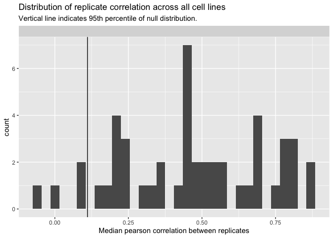
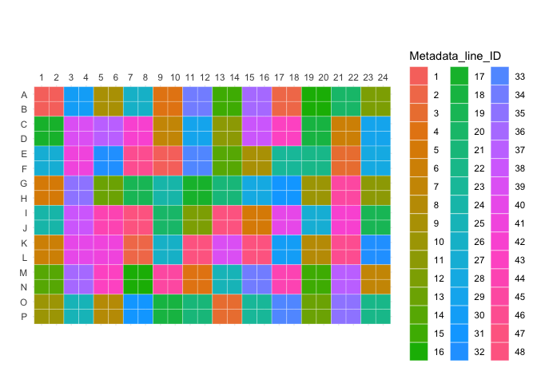
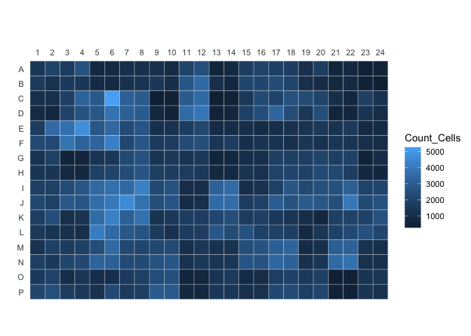
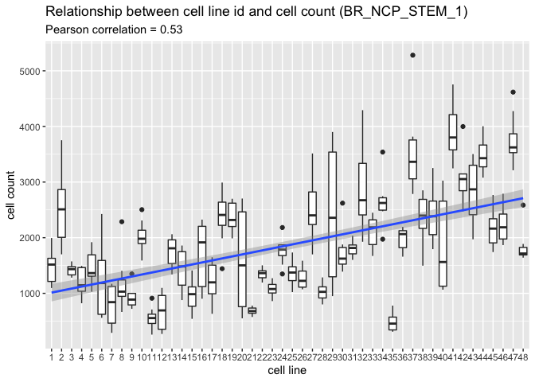
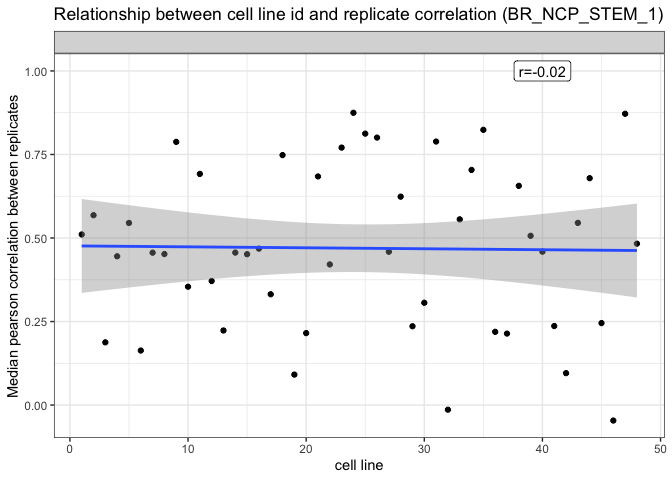
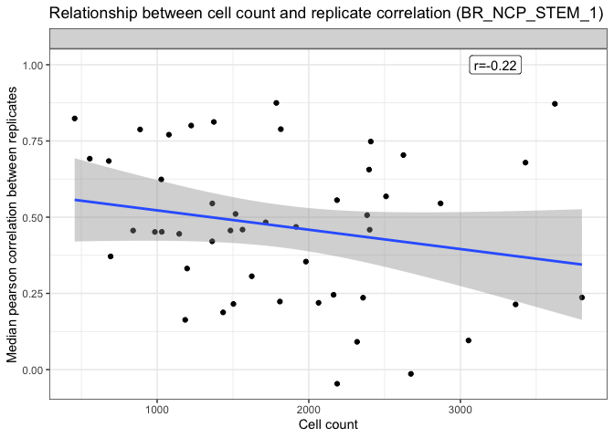
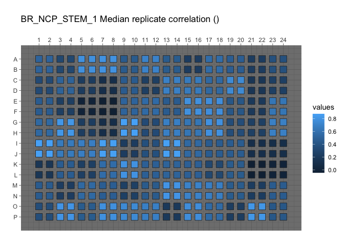
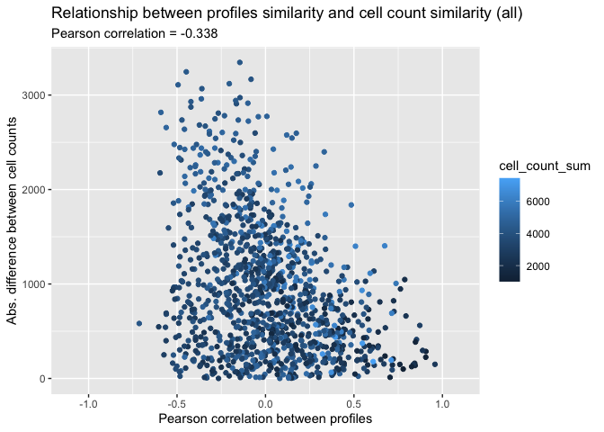
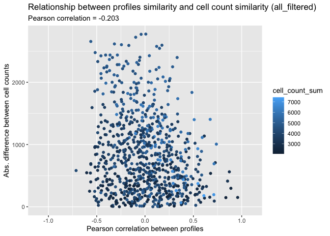

Inspect profiles
================
Shantanu Singh
Nov 2020

-   [Load libraries](#load-libraries)
-   [Data overview](#data-overview)
    -   [Read profiles](#read-profiles)
    -   [How many replicates?](#how-many-replicates)
    -   [Audits](#audits)
-   [Is cell plating density correlated with the order of plating a cell
    line?](#is-cell-plating-density-correlated-with-the-order-of-plating-a-cell-line)
    -   [Display platemap](#display-platemap)
    -   [Plot cell counts on plate map](#plot-cell-counts-on-plate-map)
    -   [Plot cell count vs cell id](#plot-cell-count-vs-cell-id)
-   [Is median replicate correlation correlated with other
    factors?](#is-median-replicate-correlation-correlated-with-other-factors)
    -   [Is median replicate correlation correlated with cell
        id?](#is-median-replicate-correlation-correlated-with-cell-id)
    -   [Is median replicate correlation correlated with cell
        count?](#is-median-replicate-correlation-correlated-with-cell-count)
    -   [Attach cell count and replicate correlation to profiles and
        save
        gct](#attach-cell-count-and-replicate-correlation-to-profiles-and-save-gct)
    -   [Plot median replicate correlation on a plate
        map](#plot-median-replicate-correlation-on-a-plate-map)
-   [Does cell plating density drive
    similarities?](#does-cell-plating-density-drive-similarities)
    -   [Aggregate profiles and cell counts, grouping by cell line and
        plating
        density](#aggregate-profiles-and-cell-counts-grouping-by-cell-line-and-plating-density)
    -   [Measure similarity between
        profiles](#measure-similarity-between-profiles)
    -   [Report relationship between profiles similarity and cell count
        similarity](#report-relationship-between-profiles-similarity-and-cell-count-similarity)

## Load libraries

``` r
library(ggplot2)
library(glue)
library(magrittr)
library(tidyverse)
```

``` r
simple_aggregate <- function(population, variables, strata, operation="mean") {
  population %>%
    dplyr::group_by_at(.vars = strata) %>%
    dplyr::summarise_at(.funs = operation, .vars = variables) %>%
    dplyr::ungroup()
}
```

## Data overview

### Read profiles

``` r
batch_id <- "NCP_STEM_1"

platemap <- "BR_NCP_STEM_1"

plate_id <- "BR_NCP_STEM_1"

profiles <-
  read_csv(file.path("profiles", batch_id, plate_id, paste0(plate_id, "_normalized_variable_selected.csv.gz")),
           progress = FALSE)
```

``` r
cp_column_match <- "^Cells|^Nuclei|^Cytoplasm"

variables <- str_subset(names(profiles), cp_column_match)
```

Report the size of feature spaces

``` r
tribble(~profile_type, ~feature_space,
        "all", length(variables)
)
```

<div class="kable-table">

| profile\_type | feature\_space |
|:--------------|---------------:|
| all           |            414 |

</div>

``` r
profiles %>% select(matches("Metadata_")) %>%
  head()
```

<div class="kable-table">

| Metadata\_Plate  | Metadata\_Well | Metadata\_Assay\_Plate\_Barcode | Metadata\_Plate\_Map\_Name | Metadata\_well\_position | Metadata\_plating\_density | Metadata\_line\_ID | Metadata\_line\_condition | Metadata\_line\_source |
|:-----------------|:---------------|:--------------------------------|:---------------------------|:-------------------------|---------------------------:|-------------------:|:--------------------------|:-----------------------|
| BR\_NCP\_STEM\_1 | A01            | BR\_NCP\_STEM\_1                | BR\_NCP\_STEM\_1           | A01                      |                      10000 |                  1 | control                   | human                  |
| BR\_NCP\_STEM\_1 | A02            | BR\_NCP\_STEM\_1                | BR\_NCP\_STEM\_1           | A02                      |                      10000 |                  1 | control                   | human                  |
| BR\_NCP\_STEM\_1 | A03            | BR\_NCP\_STEM\_1                | BR\_NCP\_STEM\_1           | A03                      |                      10000 |                 30 | deletion                  | human                  |
| BR\_NCP\_STEM\_1 | A04            | BR\_NCP\_STEM\_1                | BR\_NCP\_STEM\_1           | A04                      |                      10000 |                 30 | deletion                  | human                  |
| BR\_NCP\_STEM\_1 | A05            | BR\_NCP\_STEM\_1                | BR\_NCP\_STEM\_1           | A05                      |                      10000 |                  9 | control                   | human                  |
| BR\_NCP\_STEM\_1 | A06            | BR\_NCP\_STEM\_1                | BR\_NCP\_STEM\_1           | A06                      |                      10000 |                  9 | control                   | human                  |

</div>

### How many replicates?

Report based on metadata

``` r
metadata <- read_tsv(file.path("metadata", batch_id, "platemap", paste0(platemap, ".txt")))
```

    ##
    ## ── Column specification ──────────────────────────────────────────────────────────────────────────────────────────────────
    ## cols(
    ##   plate_map_name = col_character(),
    ##   well_position = col_character(),
    ##   plating_density = col_double(),
    ##   line_ID = col_double(),
    ##   line_condition = col_character(),
    ##   line_source = col_character()
    ## )

``` r
metadata %<>%
  rename(
  Metadata_Plate_Map_Name = plate_map_name,
  Metadata_Well = well_position,
  Metadata_plating_density = plating_density,
  Metadata_line_ID = line_ID) %>%
  mutate(
    Metadata_Plate = "BR_NCP_STEM_1"
  )

metadata %>%
  group_by(Metadata_line_ID) %>%
  tally()
```

<div class="kable-table">

| Metadata\_line\_ID |   n |
|-------------------:|----:|
|                  1 |   8 |
|                  2 |   8 |
|                  3 |   8 |
|                  4 |   8 |
|                  5 |   8 |
|                  6 |   8 |
|                  7 |   8 |
|                  8 |   8 |
|                  9 |   8 |
|                 10 |   8 |
|                 11 |   8 |
|                 12 |   8 |
|                 13 |   8 |
|                 14 |   8 |
|                 15 |   8 |
|                 16 |   8 |
|                 17 |   8 |
|                 18 |   8 |
|                 19 |   8 |
|                 20 |   8 |
|                 21 |   8 |
|                 22 |   8 |
|                 23 |   8 |
|                 24 |   8 |
|                 25 |   8 |
|                 26 |   8 |
|                 27 |   8 |
|                 28 |   8 |
|                 29 |   8 |
|                 30 |   8 |
|                 31 |   8 |
|                 32 |   8 |
|                 33 |   8 |
|                 34 |   8 |
|                 35 |   8 |
|                 36 |   8 |
|                 37 |   8 |
|                 38 |   8 |
|                 39 |   8 |
|                 40 |   8 |
|                 41 |   8 |
|                 42 |   8 |
|                 43 |   8 |
|                 44 |   8 |
|                 45 |   8 |
|                 46 |   8 |
|                 47 |   8 |
|                 48 |   8 |

</div>

Report based on profiles (should be identical)

``` r
replicates_per_line <-
  profiles %>%
  group_by(Metadata_Plate, Metadata_line_ID) %>%
  tally()

replicates_per_line
```

<div class="kable-table">

| Metadata\_Plate  | Metadata\_line\_ID |   n |
|:-----------------|-------------------:|----:|
| BR\_NCP\_STEM\_1 |                  1 |   8 |
| BR\_NCP\_STEM\_1 |                  2 |   8 |
| BR\_NCP\_STEM\_1 |                  3 |   8 |
| BR\_NCP\_STEM\_1 |                  4 |   8 |
| BR\_NCP\_STEM\_1 |                  5 |   8 |
| BR\_NCP\_STEM\_1 |                  6 |   8 |
| BR\_NCP\_STEM\_1 |                  7 |   8 |
| BR\_NCP\_STEM\_1 |                  8 |   8 |
| BR\_NCP\_STEM\_1 |                  9 |   8 |
| BR\_NCP\_STEM\_1 |                 10 |   8 |
| BR\_NCP\_STEM\_1 |                 11 |   8 |
| BR\_NCP\_STEM\_1 |                 12 |   8 |
| BR\_NCP\_STEM\_1 |                 13 |   8 |
| BR\_NCP\_STEM\_1 |                 14 |   8 |
| BR\_NCP\_STEM\_1 |                 15 |   8 |
| BR\_NCP\_STEM\_1 |                 16 |   8 |
| BR\_NCP\_STEM\_1 |                 17 |   8 |
| BR\_NCP\_STEM\_1 |                 18 |   8 |
| BR\_NCP\_STEM\_1 |                 19 |   8 |
| BR\_NCP\_STEM\_1 |                 20 |   8 |
| BR\_NCP\_STEM\_1 |                 21 |   8 |
| BR\_NCP\_STEM\_1 |                 22 |   8 |
| BR\_NCP\_STEM\_1 |                 23 |   8 |
| BR\_NCP\_STEM\_1 |                 24 |   8 |
| BR\_NCP\_STEM\_1 |                 25 |   8 |
| BR\_NCP\_STEM\_1 |                 26 |   8 |
| BR\_NCP\_STEM\_1 |                 27 |   8 |
| BR\_NCP\_STEM\_1 |                 28 |   8 |
| BR\_NCP\_STEM\_1 |                 29 |   8 |
| BR\_NCP\_STEM\_1 |                 30 |   8 |
| BR\_NCP\_STEM\_1 |                 31 |   8 |
| BR\_NCP\_STEM\_1 |                 32 |   8 |
| BR\_NCP\_STEM\_1 |                 33 |   8 |
| BR\_NCP\_STEM\_1 |                 34 |   8 |
| BR\_NCP\_STEM\_1 |                 35 |   8 |
| BR\_NCP\_STEM\_1 |                 36 |   8 |
| BR\_NCP\_STEM\_1 |                 37 |   8 |
| BR\_NCP\_STEM\_1 |                 38 |   8 |
| BR\_NCP\_STEM\_1 |                 39 |   8 |
| BR\_NCP\_STEM\_1 |                 40 |   8 |
| BR\_NCP\_STEM\_1 |                 41 |   8 |
| BR\_NCP\_STEM\_1 |                 42 |   8 |
| BR\_NCP\_STEM\_1 |                 43 |   8 |
| BR\_NCP\_STEM\_1 |                 44 |   8 |
| BR\_NCP\_STEM\_1 |                 45 |   8 |
| BR\_NCP\_STEM\_1 |                 46 |   8 |
| BR\_NCP\_STEM\_1 |                 47 |   8 |
| BR\_NCP\_STEM\_1 |                 48 |   8 |

</div>

### Audits

What is the median replicate correlation for each cell line? Do this
across all types of profiles

``` r
audit_detailed_all <- tibble()

audit_all <- tibble()

audit_dir <- file.path("..", "..", "..", "audit")

for (profile_type_i in c("")) {
  audit <- read_csv(
    glue(
      file.path(audit_dir, batch_id, "{platemap}_audit{profile_type_i}.csv"),
      profile_type_i = profile_type_i
    )
  )

  audit_detailed <- read_csv(
    glue(
      file.path(audit_dir, batch_id, "{platemap}_audit{profile_type_i}_detailed.csv"),
      profile_type_i = profile_type_i
    )
  )

  audit_detailed_all <-
    bind_rows(audit_detailed_all,
              audit_detailed %>% mutate(profile_type = profile_type_i))
  audit_all <-
    bind_rows(audit_all,
              audit %>% mutate(profile_type = profile_type_i))

}

p <-
  ggplot(audit_detailed_all,
         aes(correlation)) +
  geom_histogram(binwidth = .03) +
  geom_vline(aes(xintercept = null_threshold), audit_all) +
  xlab("Median pearson correlation between replicates") +
  facet_wrap(~profile_type, ncol = 1) +
  ggtitle(
    "Distribution of replicate correlation across all cell lines",
    subtitle = "Vertical line indicates 95th percentile of null distribution."
  )

print(p)
```

<!-- -->

``` r
dir.create("figures", showWarnings = FALSE)

ggsave(file.path("figures",
                 glue("{plate_id}_replicate_correlation.png")),
       p, width = 8, height = 8)
```

## Is cell plating density correlated with the order of plating a cell line?

### Display platemap

``` r
source("utils.R")

p <-
  plot_plate(
    profiles %>%
      select(Metadata_Well, Metadata_line_ID) %>%
      mutate(Metadata_line_ID = as.factor(Metadata_line_ID)),
    variable = "Metadata_line_ID",
    well_position = "Metadata_Well"
  )

print(p)
```

<!-- -->

``` r
out_file <- file.path("figures", paste0(platemap, ".png"))

ggsave(out_file, p, height = 4, width = 6)
```

### Plot cell counts on plate map

``` r
cell_count <-
  read_csv(file.path("profiles",  batch_id, plate_id, paste0(plate_id, "_count.csv.gz"))) %>%
  select(Metadata_Plate, Metadata_Well, Count_Cells)
```

    ##
    ## ── Column specification ──────────────────────────────────────────────────────────────────────────────────────────────────
    ## cols(
    ##   Metadata_Plate = col_character(),
    ##   Metadata_Well = col_character(),
    ##   Count_Cells = col_double()
    ## )

``` r
cell_count %<>%
  inner_join(
    metadata,
    by = c("Metadata_Plate", "Metadata_Well")
  )

p <-
  plot_plate(
    cell_count %>%
      select(Metadata_Well, Count_Cells),
    variable = "Count_Cells",
    well_position = "Metadata_Well"
  )

print(p)
```

<!-- -->

``` r
out_file <- file.path("figures", paste0(platemap, "_count.png"))

ggsave(out_file, p, height = 4, width = 6)
```

### Plot cell count vs cell id

The cell line id corresponds to the order in which the cells were
plated. We suspected that a longer settling time (i.e. smaller value of
cell line id) was resulting in higher cell count.

``` r
p <-
  ggplot(cell_count,
         aes(Metadata_line_ID, Count_Cells)) +
  geom_boxplot(aes(as.factor(Metadata_line_ID), Count_Cells)) +
  geom_smooth(method = "lm") +
  xlab("cell line") +
  ylab("cell count") +
  ggtitle(glue("Relationship between cell line id and cell count ({plate_id})"),
          subtitle = sprintf("Pearson correlation = %.2f",
                             with(cell_count, cor(Count_Cells, Metadata_line_ID))
                             )
          )

p
```

    ## `geom_smooth()` using formula 'y ~ x'

<!-- -->

``` r
ggsave(file.path("figures",
                 glue("{plate_id}_cell_counts_across_replicates.png")),
       p, width = 8, height = 5)
```

    ## `geom_smooth()` using formula 'y ~ x'

## Is median replicate correlation correlated with other factors?

``` r
df <-
  audit_detailed_all %>%
  inner_join(
    cell_count %>%
      simple_aggregate(
        variables = c("Count_Cells"),
        strata = c("Metadata_line_ID", "Metadata_plating_density"),
        operation = "median"
      ),
    by = c("Metadata_line_ID", "Metadata_plating_density")
  )
```

### Is median replicate correlation correlated with cell id?

``` r
cor_df <-
  audit_detailed_all %>%
  group_by(profile_type) %>%
  summarize(corval = cor(correlation, Metadata_line_ID), .groups = "keep")

p <-
  ggplot(audit_detailed_all,
         aes(Metadata_line_ID, correlation)) +
  geom_point() +
  geom_smooth(method = "lm") +
  geom_label(aes(x = 40, y = 1, label = sprintf("r=%.2f", corval)), data = cor_df) +
  theme_bw() +
  xlab("cell line") +
  ylab("Median pearson correlation between replicates") +
  facet_wrap(~profile_type, nrow = 1) +
  ggtitle(glue("Relationship between cell line id and replicate correlation ({plate_id})"))

p
```

    ## `geom_smooth()` using formula 'y ~ x'

<!-- -->

``` r
ggsave(file.path("figures",
                 glue("{plate_id}_cell_lines_vs_replicate_correlation.png")),
       p, width = 8, height = 5)
```

    ## `geom_smooth()` using formula 'y ~ x'

### Is median replicate correlation correlated with cell count?

``` r
cor_df <-
  df %>%
  group_by(profile_type) %>%
  summarize(corval = cor(Count_Cells, correlation), .groups = "keep")

p <-
  ggplot(df,
         aes(Count_Cells, correlation)) +
  geom_point() +
  geom_label(aes(x = 0.85 * max(df$Count_Cells), y = 1, label = sprintf("r=%.2f", corval)), data = cor_df) +
  theme_bw() +
  geom_smooth(method = "lm") +
  xlab("Cell count") +
  ylab("Median pearson correlation between replicates") +
  facet_wrap(~profile_type, nrow = 1) +
  ggtitle(glue("Relationship between cell count and replicate correlation ({plate_id})"))

p
```

    ## `geom_smooth()` using formula 'y ~ x'

<!-- -->

``` r
ggsave(file.path("figures",
                 glue("{plate_id}_cell_count_vs_replicate_correlation.png")),
       p, width = 8, height = 5)
```

    ## `geom_smooth()` using formula 'y ~ x'

### Attach cell count and replicate correlation to profiles and save gct

``` r
create_augmented_profiles <- function(profiles, profile_type_i) {
  augmented_profiles_i <-
    profiles %>%
    inner_join(df %>% filter(profile_type == profile_type_i),
               c("Metadata_Plate_Map_Name", "Metadata_plating_density", "Metadata_line_ID")) %>%
    rename(Metadata_correlation = correlation,
           Metadata_Count_Cells = Count_Cells) %>%
    select(matches("^Metadata_"), everything())

  augmented_profiles_i %>%
   write_csv(file.path("profiles", glue("{plate_id}{profile_type_i}_normalized_variable_selected_augmented.csv.gz")))

  augmented_profiles_i
}

augmented_profiles <- create_augmented_profiles(profiles, "")
```

``` sh
cd ../../cytominer_scripts

Rscript csv2gct.R \
  ../../backend/2019_06_10_Batch3/cmqtlpl1.5-31-2019-mt/cmqtlpl1.5-31-2019-mt_normalized_variable_selected_augmented.csv \
  -o ../../backend/2019_06_10_Batch3/cmqtlpl1.5-31-2019-mt/cmqtlpl1.5-31-2019-mt_normalized_variable_selected_augmented.gct

cd -
```

### Plot median replicate correlation on a plate map

``` r
plot_replicate_correlations_platemap <- function(augmented_profiles_i, profile_type) {

  p <-
    platetools::raw_map(
      data = augmented_profiles_i$Metadata_correlation,
      well = augmented_profiles_i$Metadata_Well,
      plate = 384
    ) +
    ggtitle(
        glue("{plate_id} Median replicate correlation ({profile_type})")
    ) +
    theme_dark() +
    scale_fill_continuous()

  print(p)
}

plot_replicate_correlations_platemap(augmented_profiles, "")
```

<!-- -->

## Does cell plating density drive similarities?

### Aggregate profiles and cell counts, grouping by cell line and plating density

``` r
aggregate_profiles <- function(profiles) {
  variables <- str_subset(names(profiles), cp_column_match)

  profiles %<>%
    simple_aggregate(variables = variables,
                         strata = c("Metadata_line_ID", "Metadata_plating_density"),
                         operation = "median")
}

profiles %<>% aggregate_profiles()

cell_count %<>%
  simple_aggregate(variables = c("Count_Cells"),
                       strata = c("Metadata_line_ID", "Metadata_plating_density"),
                       operation = "median")
```

### Measure similarity between profiles

``` r
measure_profile_similarity <- function(profiles) {
  # get data matrix
  data_matrix <-
    profiles %>%
    select(-matches("Metadata"))

  # get metadata
  metadata <-
    profiles %>%
    select(matches("Metadata")) %>%
    rowid_to_column(var = "id")

  # measure similarities between treatments
  similarity_i <- cor(t(data_matrix))

  colnames(similarity_i) <- seq(1, ncol(similarity_i))

  similarity_i %<>%
    as_tibble() %>%
    rowid_to_column(var = "id1") %>%
    gather(id2, correlation, -id1) %>%
    mutate(id2 = as.integer(id2)) %>%
    filter(id1 > id2) %>%
    arrange(desc(correlation))

  # annotate the similarities data frame
  similarity_i %<>%
    inner_join(metadata %>%
                 select(id,
                        Metadata_line_ID,
                        Metadata_plating_density),
               by = c("id1" = "id")) %>%
    rename(Metadata_line_ID1 = Metadata_line_ID,
           Metadata_plating_density1 = Metadata_plating_density)  %>%
    inner_join(metadata %>%
                 select(id,
                        Metadata_line_ID,
                        Metadata_plating_density),
               by = c("id2" = "id")) %>%
    rename(Metadata_line_ID2 = Metadata_line_ID,
           Metadata_plating_density2 = Metadata_plating_density) %>%
    arrange(desc(correlation))
}

similarity_all <- measure_profile_similarity(profiles)
```

``` r
attach_cell_count <- function(similarity_i) {
  similarity_i %>%
    inner_join(cell_count,
               by = c("Metadata_line_ID1" = "Metadata_line_ID",
                      "Metadata_plating_density1" = "Metadata_plating_density")
               ) %>%
    rename(Count_Cells1 = Count_Cells) %>%
    inner_join(cell_count,
               by = c("Metadata_line_ID2" = "Metadata_line_ID",
                      "Metadata_plating_density2" = "Metadata_plating_density")
               ) %>%
    rename(Count_Cells2 = Count_Cells) %>%
    mutate(cell_count_abs_diff = abs(Count_Cells1 - Count_Cells2)) %>%
    mutate(cell_count_sum = (Count_Cells1 + Count_Cells2))

}

similarity_all %<>% attach_cell_count()
```

### Report relationship between profiles similarity and cell count similarity

``` r
plot_and_save_similarities <- function(similarity, profile_type) {
  p <-
    ggplot(similarity, aes(correlation, cell_count_abs_diff, color = cell_count_sum)) +
    geom_point() +
    xlab("Pearson correlation between profiles") +
    ylab("Abs. difference between cell counts") +
    xlim(-1.1, 1.1) +
    ggtitle(glue("Relationship between profiles similarity and cell count similarity ({profile_type})"),
            subtitle = sprintf("Pearson correlation = %.3f",
                               with(similarity, cor(correlation, cell_count_abs_diff))
                               )
            )

  print(p)

  ggsave(file.path("figures",
                   glue("{plate_id}_profiles_similarity_vs_cell_count_similarity_{profile_type}.png")),
         p, width = 7, height = 5)

  similarity %>% write_csv(file.path("data", glue("NCP_STEM_1_similarity_{profile_type}.csv")))
}
```

Report for all cell lines

``` r
dir.create("data", showWarnings = FALSE)

plot_and_save_similarities(similarity = similarity_all, profile_type = "all")
```

<!-- -->

Report for cell lines after filtering out those that have too few or too
many cells

``` r
filter_cell_lines <- function(similarity_i) {

  similarity_i %>%
    filter(between(Count_Cells1, 1000, 4000)) %>%
    filter(between(Count_Cells2, 1000, 4000))

}

plot_and_save_similarities(similarity = filter_cell_lines(similarity_all), profile_type = "all_filtered")
```

<!-- -->
