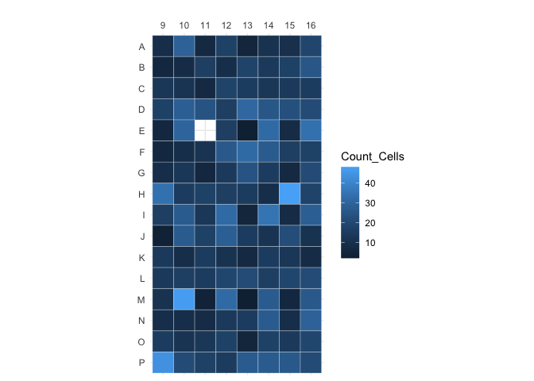
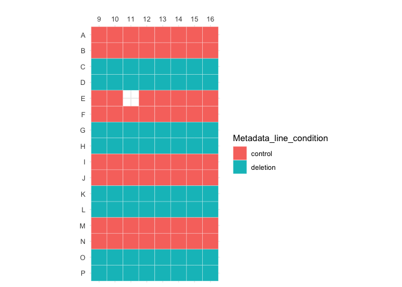
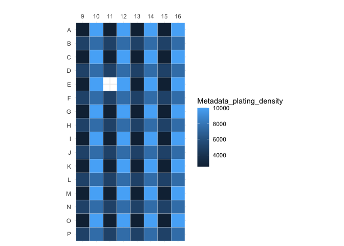
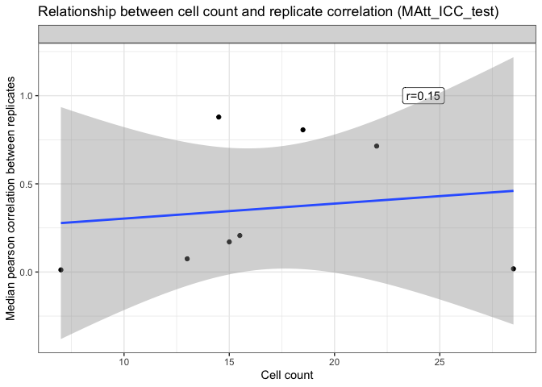
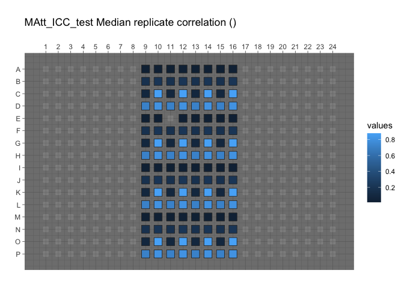
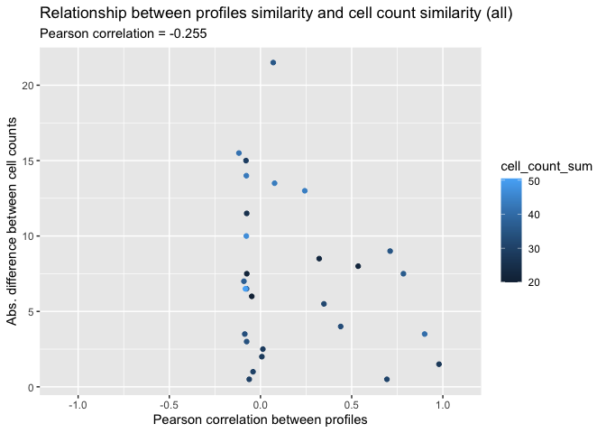

Inspect profiles
================
Shantanu Singh
Nov 2020

-   [0.1 Load libraries](#load-libraries)
-   [0.2 Data overview](#data-overview)
    -   [0.2.1 Read profiles](#read-profiles)
    -   [0.2.2 How many replicates?](#how-many-replicates)
    -   [0.2.3 Audits](#audits)
-   [0.3 Is cell plating density correlated with the order of plating a
    cell
    line?](#is-cell-plating-density-correlated-with-the-order-of-plating-a-cell-line)
    -   [0.3.1 Display platemap](#display-platemap)
    -   [0.3.2 Plot cell counts on plate
        map](#plot-cell-counts-on-plate-map)
-   [0.4 Is median replicate correlation correlated with other
    factors?](#is-median-replicate-correlation-correlated-with-other-factors)
    -   [0.4.1 Is median replicate correlation correlated with cell
        count?](#is-median-replicate-correlation-correlated-with-cell-count)
    -   [0.4.2 Attach cell count and replicate correlation to profiles
        and save
        gct](#attach-cell-count-and-replicate-correlation-to-profiles-and-save-gct)
    -   [0.4.3 Plot median replicate correlation on a plate
        map](#plot-median-replicate-correlation-on-a-plate-map)
-   [0.5 Does cell plating density drive
    similarities?](#does-cell-plating-density-drive-similarities)
    -   [0.5.1 Aggregate profiles and cell counts, grouping by cell line
        and plating
        density](#aggregate-profiles-and-cell-counts-grouping-by-cell-line-and-plating-density)
    -   [0.5.2 Measure similarity between
        profiles](#measure-similarity-between-profiles)
    -   [0.5.3 Report relationship between profiles similarity and cell
        count
        similarity](#report-relationship-between-profiles-similarity-and-cell-count-similarity)

If running interactively in RStudio,

-   change `output` in the header of this markdown to `html_notebook`
    and
-   change to `eval=TRUE` below

When knitting for pushing to GitHub,

-   change `output` in the header of this markdown to `github_document`
    and
-   change to `eval=FALSE` below

``` r
show_table <- knitr::kable
```

## 0.1 Load libraries

``` r
library(ggplot2)
library(glue)
library(magrittr)
library(tidyverse)
```

``` r
simple_aggregate <- function(population, variables, strata, operation="mean") {
  population %>%
    dplyr::group_by_at(.vars = strata) %>%
    dplyr::summarise_at(.funs = operation, .vars = variables) %>%
    dplyr::ungroup()
}
```

## 0.2 Data overview

### 0.2.1 Read profiles

``` r
batch_id <- "NCP_PILOT_3B"

platemap <- "MAtt_ICC_test"

plate_id <- "MAtt_ICC_test"

profiles <- 
  read_csv(file.path("profiles", batch_id, plate_id, paste0(plate_id, "_normalized_variable_selected.csv.gz")), 
           progress = FALSE)
```

``` r
variables <- str_subset(names(profiles), "^Metadata_", negate = TRUE)
```

Report the size of feature spaces

``` r
tribble(~profile_type, ~feature_space,
        "all", length(variables)
) %>%
  show_table
```

| profile\_type | feature\_space |
|:--------------|---------------:|
| all           |            873 |

``` r
profiles %>% select(matches("Metadata_")) %>% 
  head() %>%
  show_table
```

| Metadata\_Plate | Metadata\_Well | Metadata\_Assay\_Plate\_Barcode | Metadata\_Plate\_Map\_Name | Metadata\_well\_position | Metadata\_plating\_density | Metadata\_line\_condition |
|:----------------|:---------------|:--------------------------------|:---------------------------|:-------------------------|---------------------------:|:--------------------------|
| MAtt\_ICC\_test | A09            | MAtt\_ICC\_test                 | MAtt\_ICC\_test            | A09                      |                       2500 | control                   |
| MAtt\_ICC\_test | A10            | MAtt\_ICC\_test                 | MAtt\_ICC\_test            | A10                      |                      10000 | control                   |
| MAtt\_ICC\_test | A11            | MAtt\_ICC\_test                 | MAtt\_ICC\_test            | A11                      |                       2500 | control                   |
| MAtt\_ICC\_test | A12            | MAtt\_ICC\_test                 | MAtt\_ICC\_test            | A12                      |                      10000 | control                   |
| MAtt\_ICC\_test | A13            | MAtt\_ICC\_test                 | MAtt\_ICC\_test            | A13                      |                       2500 | control                   |
| MAtt\_ICC\_test | A14            | MAtt\_ICC\_test                 | MAtt\_ICC\_test            | A14                      |                      10000 | control                   |

### 0.2.2 How many replicates?

Report based on metadata

``` r
metadata <- read_tsv(file.path("metadata", batch_id, "platemap", paste0(platemap, ".txt")))
```

    ## 
    ## ── Column specification ────────────────────────────────────────────────────────────────────────────────────
    ## cols(
    ##   plate_map_name = col_character(),
    ##   well_position = col_character(),
    ##   plating_density = col_double(),
    ##   line_condition = col_character()
    ## )

``` r
metadata %<>%
  rename(
  Metadata_Plate_Map_Name = plate_map_name,
  Metadata_Well = well_position,
  Metadata_plating_density = plating_density,
  Metadata_line_condition = line_condition) %>%
  mutate(
    Metadata_Plate = "MAtt_ICC_test"
  ) 

metadata %>% 
  group_by(Metadata_plating_density,
           Metadata_line_condition) %>%
  tally() %>%
  show_table
```

| Metadata\_plating\_density | Metadata\_line\_condition |   n |
|---------------------------:|:--------------------------|----:|
|                       2500 | control                   |  48 |
|                       2500 | deletion                  |  48 |
|                       5000 | control                   |  48 |
|                       5000 | deletion                  |  48 |
|                       7500 | control                   |  48 |
|                       7500 | deletion                  |  48 |
|                      10000 | control                   |  48 |
|                      10000 | deletion                  |  48 |

Report based on profiles (will not be identical because not all wells
were stained + imaged)

``` r
replicates_per_line <- 
  profiles %>%
  group_by(Metadata_Plate, 
           Metadata_plating_density,
           Metadata_line_condition) %>%
  tally()

replicates_per_line %>%
  show_table
```

| Metadata\_Plate | Metadata\_plating\_density | Metadata\_line\_condition |   n |
|:----------------|---------------------------:|:--------------------------|----:|
| MAtt\_ICC\_test |                       2500 | control                   |  15 |
| MAtt\_ICC\_test |                       2500 | deletion                  |  16 |
| MAtt\_ICC\_test |                       5000 | control                   |  16 |
| MAtt\_ICC\_test |                       5000 | deletion                  |  16 |
| MAtt\_ICC\_test |                       7500 | control                   |  16 |
| MAtt\_ICC\_test |                       7500 | deletion                  |  16 |
| MAtt\_ICC\_test |                      10000 | control                   |  16 |
| MAtt\_ICC\_test |                      10000 | deletion                  |  16 |

### 0.2.3 Audits

What is the median replicate correlation for each cell line? Do this
across all types of profiles

``` r
audit_detailed_all <- tibble()

audit_all <- tibble()

audit_dir <- file.path("..", "..", "..", "audit")

for (profile_type_i in c("")) {
  audit <- read_csv(
    glue(
      file.path(audit_dir, batch_id, "{platemap}_audit{profile_type_i}.csv"),
      profile_type_i = profile_type_i
    )
  )
  
  audit_detailed <- read_csv(
    glue(
      file.path(audit_dir, batch_id, "{platemap}_audit{profile_type_i}_detailed.csv"),
      profile_type_i = profile_type_i
    )
  )
  
  audit_detailed_all <- 
    bind_rows(audit_detailed_all,
              audit_detailed %>% mutate(profile_type = profile_type_i))
  audit_all <- 
    bind_rows(audit_all,
              audit %>% mutate(profile_type = profile_type_i))
  
}

p <-
  ggplot(audit_detailed_all,
         aes(correlation)) +
  geom_histogram(binwidth = .03) +
  geom_vline(aes(xintercept = null_threshold), audit_all) +
  xlab("Median pearson correlation between replicates") +
  facet_wrap(~profile_type, ncol = 1) +
  ggtitle(
    "Distribution of replicate correlation across all cell lines",
    subtitle = "Vertical line indicates 95th percentile of null distribution."
  )

print(p)
```

<!-- -->

``` r
dir.create("figures", showWarnings = FALSE)

ggsave(file.path("figures", 
                 glue("{plate_id}_replicate_correlation.png")), 
       p, width = 8, height = 8)
```

## 0.3 Is cell plating density correlated with the order of plating a cell line?

### 0.3.1 Display platemap

``` r
source("utils.R")

p <-
  plot_plate(
    profiles %>%
      select(Metadata_Well, Metadata_line_condition) %>%
      mutate(Metadata_line_condition = as.factor(Metadata_line_condition)),
    variable = "Metadata_line_condition",
    well_position = "Metadata_Well"
  )

print(p)
```

<!-- -->

``` r
out_file <- file.path("figures", paste0(platemap, "_line.png"))

ggsave(out_file, p, height = 4, width = 6)

p <-
  plot_plate(
    profiles %>%
      select(Metadata_Well, Metadata_plating_density),
    variable = "Metadata_plating_density",
    well_position = "Metadata_Well"
  )

print(p)
```

<!-- -->

``` r
out_file <- file.path("figures", paste0(platemap, "_density.png"))

ggsave(out_file, p, height = 4, width = 6)
```

### 0.3.2 Plot cell counts on plate map

``` r
cell_count <-
  read_csv(file.path("profiles",  batch_id, plate_id, paste0(plate_id, "_count.csv.gz"))) %>%
  select(Metadata_Plate, Metadata_Well, Count_Cells = Count_Nuclei)
```

    ## 
    ## ── Column specification ────────────────────────────────────────────────────────────────────────────────────
    ## cols(
    ##   Metadata_Plate = col_character(),
    ##   Metadata_Well = col_character(),
    ##   Count_Nuclei = col_double()
    ## )

``` r
cell_count %<>%
  inner_join(
    metadata,
    by = c("Metadata_Plate", "Metadata_Well")
  )
  
p <-
  plot_plate(
    cell_count %>%
      select(Metadata_Well, Count_Cells),
    variable = "Count_Cells",
    well_position = "Metadata_Well"
  )

print(p)
```

<!-- -->

``` r
out_file <- file.path("figures", paste0(platemap, "_count.png"))

ggsave(out_file, p, height = 4, width = 6)
```

## 0.4 Is median replicate correlation correlated with other factors?

``` r
df <-
  audit_detailed_all %>%
  inner_join(
    cell_count %>%
      simple_aggregate(
        variables = c("Count_Cells"),
        strata = c("Metadata_line_condition",
                   "Metadata_plating_density"),
        operation = "median"
      ),
    by = c("Metadata_line_condition",
           "Metadata_plating_density")
  )
```

### 0.4.1 Is median replicate correlation correlated with cell count?

``` r
cor_df <- 
  df %>%
  group_by(profile_type) %>%
  summarize(corval = cor(Count_Cells, correlation), .groups = "keep")

p <-
  ggplot(df,
         aes(Count_Cells, correlation)) +
  geom_point() +
  geom_label(aes(x = 0.85 * max(df$Count_Cells), y = 1, label = sprintf("r=%.2f", corval)), data = cor_df) +
  theme_bw() +
  geom_smooth(method = "lm") +
  xlab("Cell count") +
  ylab("Median pearson correlation between replicates") +
  facet_wrap(~profile_type, nrow = 1) +
  ggtitle(glue("Relationship between cell count and replicate correlation ({plate_id})"))

p
```

    ## `geom_smooth()` using formula 'y ~ x'

<!-- -->

``` r
ggsave(file.path("figures", 
                 glue("{plate_id}_cell_count_vs_replicate_correlation.png")), 
       p, width = 8, height = 5)
```

    ## `geom_smooth()` using formula 'y ~ x'

### 0.4.2 Attach cell count and replicate correlation to profiles and save gct

``` r
create_augmented_profiles <- function(profiles, profile_type_i) {
  augmented_profiles_i <-
    profiles %>% 
    inner_join(df %>% filter(profile_type == profile_type_i),
               c("Metadata_Plate_Map_Name", 
                 "Metadata_line_condition",
                 "Metadata_plating_density")) %>%
    rename(Metadata_correlation = correlation,
           Metadata_Count_Cells = Count_Cells) %>%
    select(matches("^Metadata_"), everything())
  
  augmented_profiles_i %>%
   write_csv(file.path("profiles", glue("{plate_id}{profile_type_i}_normalized_variable_selected_augmented.csv.gz")))
  
  augmented_profiles_i
}

augmented_profiles <- create_augmented_profiles(profiles, "")
```

``` sh
cd ../../cytominer_scripts

Rscript csv2gct.R \
  ../../backend/2019_06_10_Batch3/cmqtlpl1.5-31-2019-mt/cmqtlpl1.5-31-2019-mt_normalized_variable_selected_augmented.csv \
  -o ../../backend/2019_06_10_Batch3/cmqtlpl1.5-31-2019-mt/cmqtlpl1.5-31-2019-mt_normalized_variable_selected_augmented.gct

cd -
```

### 0.4.3 Plot median replicate correlation on a plate map

``` r
plot_replicate_correlations_platemap <- function(augmented_profiles_i, profile_type) {

  p <-
    platetools::raw_map(
      data = augmented_profiles_i$Metadata_correlation,
      well = augmented_profiles_i$Metadata_Well,
      plate = 384
    ) +
    ggtitle(
        glue("{plate_id} Median replicate correlation ({profile_type})")
    ) +
    theme_dark() +
    scale_fill_continuous()
  
  print(p)
}

plot_replicate_correlations_platemap(augmented_profiles, "")
```

    ## Warning: Warning: Your well label count ( 127 ) covers less than half the selected plate( 384 ).
    ## Are you sure argument 'plate' is correct for the number of wells in your data?
    ## note: Default is a 96-well plate.

<!-- -->

## 0.5 Does cell plating density drive similarities?

### 0.5.1 Aggregate profiles and cell counts, grouping by cell line and plating density

``` r
aggregate_profiles <- function(profiles) {
  variables <- str_subset(names(profiles), "^Metadata_", negate=TRUE)
  
  profiles %<>%
    simple_aggregate(
      variables = variables,
      strata = c(
        "Metadata_line_condition",
        "Metadata_plating_density"
      ),
      operation = "median"
    )
}

profiles %<>% aggregate_profiles()

cell_count %<>%
  simple_aggregate(
    variables = c("Count_Cells"),
    strata = c(
      "Metadata_line_condition",
      "Metadata_plating_density"
    ),
    operation = "median"
  )
```

### 0.5.2 Measure similarity between profiles

``` r
measure_profile_similarity <- function(profiles) {
  # get data matrix
  data_matrix <-
    profiles %>%
    select(-matches("Metadata"))
  
  # get metadata
  metadata <-
    profiles %>%
    select(matches("Metadata")) %>%
    rowid_to_column(var = "id")
  
  # measure similarities between treatments
  similarity_i <- cor(t(data_matrix))
  
  colnames(similarity_i) <- seq(1, ncol(similarity_i))
  
  similarity_i %<>%
    as_tibble() %>%
    rowid_to_column(var = "id1") %>%
    gather(id2, correlation, -id1) %>%
    mutate(id2 = as.integer(id2)) %>%
    filter(id1 > id2) %>%
    arrange(desc(correlation))
  
  # annotate the similarities data frame
  similarity_i %<>%
    inner_join(
      metadata %>%
        select(
          id,
          Metadata_line_condition,
          Metadata_plating_density
        ),
      by = c("id1" = "id")
    ) %>%
    rename(
      Metadata_line_condition1 = Metadata_line_condition,
      Metadata_plating_density1 = Metadata_plating_density
    )  %>%
    inner_join(
      metadata %>%
        select(
          id,
          Metadata_line_condition,
          Metadata_plating_density
        ),
      by = c("id2" = "id")
    ) %>%
    rename(
      Metadata_line_condition2 = Metadata_line_condition,
      Metadata_plating_density2 = Metadata_plating_density
    ) %>%
    arrange(desc(correlation))
}

similarity_all <- measure_profile_similarity(profiles)
```

``` r
attach_cell_count <- function(similarity_i) {
  similarity_i %>% 
    inner_join(cell_count,
               by = c("Metadata_line_condition1" = "Metadata_line_condition", 
                      "Metadata_plating_density1" = "Metadata_plating_density")
               ) %>%
    rename(Count_Cells1 = Count_Cells) %>%
    inner_join(cell_count,
               by = c("Metadata_line_condition2" = "Metadata_line_condition", 
                      "Metadata_plating_density2" = "Metadata_plating_density")
               ) %>%
    rename(Count_Cells2 = Count_Cells) %>%
    mutate(cell_count_abs_diff = abs(Count_Cells1 - Count_Cells2)) %>%
    mutate(cell_count_sum = (Count_Cells1 + Count_Cells2))
    
} 

similarity_all %<>% attach_cell_count()
```

### 0.5.3 Report relationship between profiles similarity and cell count similarity

``` r
plot_and_save_similarities <- function(similarity, profile_type) {
  p <-
    ggplot(similarity, aes(correlation, cell_count_abs_diff, color = cell_count_sum)) +
    geom_point() +
    xlab("Pearson correlation between profiles") +
    ylab("Abs. difference between cell counts") +
    xlim(-1.1, 1.1) +
    ggtitle(glue("Relationship between profiles similarity and cell count similarity ({profile_type})"),
            subtitle = sprintf("Pearson correlation = %.3f",
                               with(similarity, cor(correlation, cell_count_abs_diff))
                               )
            )
  
  print(p)
  
  ggsave(file.path("figures", 
                   glue("{plate_id}_profiles_similarity_vs_cell_count_similarity_{profile_type}.png")), 
         p, width = 7, height = 5)
  
  similarity %>% write_csv(file.path("data", glue("NCP_PILOT_3_similarity_{profile_type}.csv")))
}
```

Report for all cell lines

``` r
dir.create("data", showWarnings = FALSE)

plot_and_save_similarities(similarity = similarity_all, profile_type = "all")
```

<!-- -->
