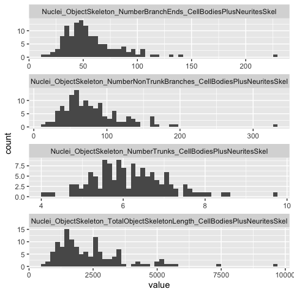
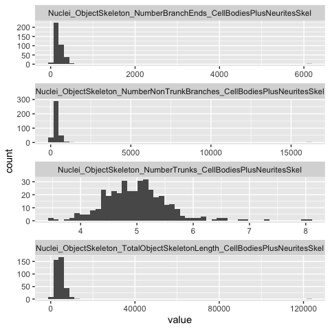

Inspect profiles
================
Shantanu Singh
June 2021

-   [1 Load libraries](#load-libraries)
-   [2 Read profiles](#read-profiles)

# 1 Load libraries

``` r
library(ggplot2)
library(glue)
library(magrittr)
library(tidyverse)
```

# 2 Read profiles

``` r
batch_id <- "NCP_PILOT_3B"

platemap <- "MAtt_ICC_test"

plate_id <- "MAtt_ICC_test"

profiles_map2 <- 
  read_csv(file.path("profiles", batch_id, plate_id, paste0(plate_id, "_augmented.csv.gz")), 
           progress = FALSE)
```

``` r
batch_id <- "NCP_PILOT_3"

platemap <- "BR_NCP_PILOT_3"

plate_id <- "BR_NCP_PILOT_3"

profiles_cp <- 
  read_csv(file.path("profiles", batch_id, plate_id, paste0(plate_id, "_augmented.csv.gz")), 
           progress = FALSE)
```

``` r
get_skel_features <- function(profiles) 
  profiles %>% select(matches("Metadata_|Skel$")) %>% select(-matches("_mito_skel$"))

count_wells <- function(profiles) 
  profiles %>% group_by(across(matches("plating_density|line_condition|compound_ID"))) %>% tally()
```

``` r
count_wells(skel_map2)
```

<div class="kable-table">

| Metadata\_plating\_density | Metadata\_line\_condition |   n |
|---------------------------:|:--------------------------|----:|
|                       2500 | control                   |  15 |
|                       2500 | deletion                  |  16 |
|                       5000 | control                   |  16 |
|                       5000 | deletion                  |  16 |
|                       7500 | control                   |  16 |
|                       7500 | deletion                  |  16 |
|                      10000 | control                   |  16 |
|                      10000 | deletion                  |  16 |

</div>

``` r
count_wells(skel_cp)
```

<div class="kable-table">

| Metadata\_plating\_density | Metadata\_line\_condition | Metadata\_compound\_ID |   n |
|---------------------------:|:--------------------------|:-----------------------|----:|
|                       2500 | control                   | BRD-K15108141-003-04-7 |   4 |
|                       2500 | control                   | BRD-K21680192-300-14-4 |   4 |
|                       2500 | control                   | BRD-K36207157-001-09-6 |   4 |
|                       2500 | control                   | BRD-K79131256-001-17-9 |   4 |
|                       2500 | control                   | NA                     |  32 |
|                       2500 | deletion                  | BRD-K15108141-003-04-7 |   3 |
|                       2500 | deletion                  | BRD-K21680192-300-14-4 |   4 |
|                       2500 | deletion                  | BRD-K36207157-001-09-6 |   4 |
|                       2500 | deletion                  | BRD-K79131256-001-17-9 |   4 |
|                       2500 | deletion                  | NA                     |  33 |
|                       5000 | control                   | BRD-K15108141-003-04-7 |   4 |
|                       5000 | control                   | BRD-K21680192-300-14-4 |   4 |
|                       5000 | control                   | BRD-K36207157-001-09-6 |   4 |
|                       5000 | control                   | BRD-K79131256-001-17-9 |   4 |
|                       5000 | control                   | NA                     |  32 |
|                       5000 | deletion                  | BRD-K15108141-003-04-7 |   4 |
|                       5000 | deletion                  | BRD-K21680192-300-14-4 |   4 |
|                       5000 | deletion                  | BRD-K36207157-001-09-6 |   4 |
|                       5000 | deletion                  | BRD-K79131256-001-17-9 |   4 |
|                       5000 | deletion                  | NA                     |  32 |
|                       7500 | control                   | BRD-K15108141-003-04-7 |   4 |
|                       7500 | control                   | BRD-K21680192-300-14-4 |   4 |
|                       7500 | control                   | BRD-K36207157-001-09-6 |   4 |
|                       7500 | control                   | BRD-K79131256-001-17-9 |   4 |
|                       7500 | control                   | NA                     |  32 |
|                       7500 | deletion                  | BRD-K15108141-003-04-7 |   4 |
|                       7500 | deletion                  | BRD-K21680192-300-14-4 |   4 |
|                       7500 | deletion                  | BRD-K36207157-001-09-6 |   4 |
|                       7500 | deletion                  | BRD-K79131256-001-17-9 |   4 |
|                       7500 | deletion                  | NA                     |  32 |
|                      10000 | control                   | BRD-K15108141-003-04-7 |   4 |
|                      10000 | control                   | BRD-K21680192-300-14-4 |   4 |
|                      10000 | control                   | BRD-K36207157-001-09-6 |   4 |
|                      10000 | control                   | BRD-K79131256-001-17-9 |   4 |
|                      10000 | control                   | NA                     |  32 |
|                      10000 | deletion                  | BRD-K15108141-003-04-7 |   4 |
|                      10000 | deletion                  | BRD-K21680192-300-14-4 |   4 |
|                      10000 | deletion                  | BRD-K36207157-001-09-6 |   4 |
|                      10000 | deletion                  | BRD-K79131256-001-17-9 |   4 |
|                      10000 | deletion                  | NA                     |  32 |

</div>

``` r
skel_map2 <- get_skel_features(profiles_map2)

skel_cp <- get_skel_features(profiles_cp)
```

``` r
skel_map2 %>%
  pivot_longer(-matches("Metadata")) %>%
  ggplot(aes(value)) + geom_histogram(bins = 50) + facet_wrap(~name, scales = "free", ncol = 1)
```

<!-- -->

``` r
skel_cp %>%
  pivot_longer(-matches("Metadata")) %>%
  ggplot(aes(value)) + geom_histogram(bins = 50) + facet_wrap(~name, scales = "free", ncol = 1)
```

<!-- -->
