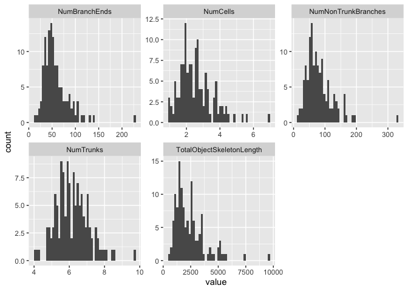
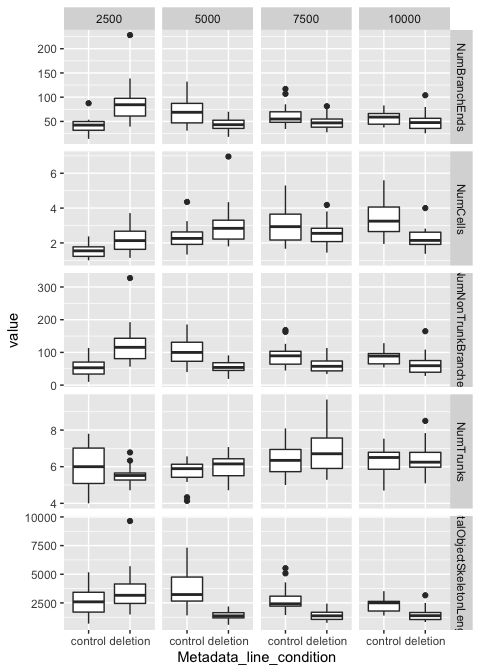
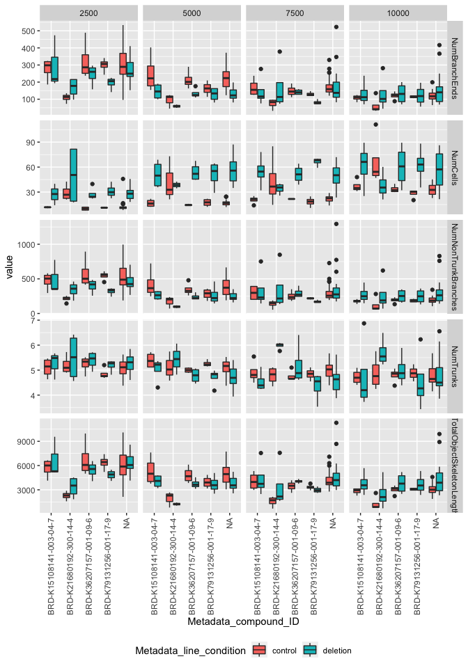
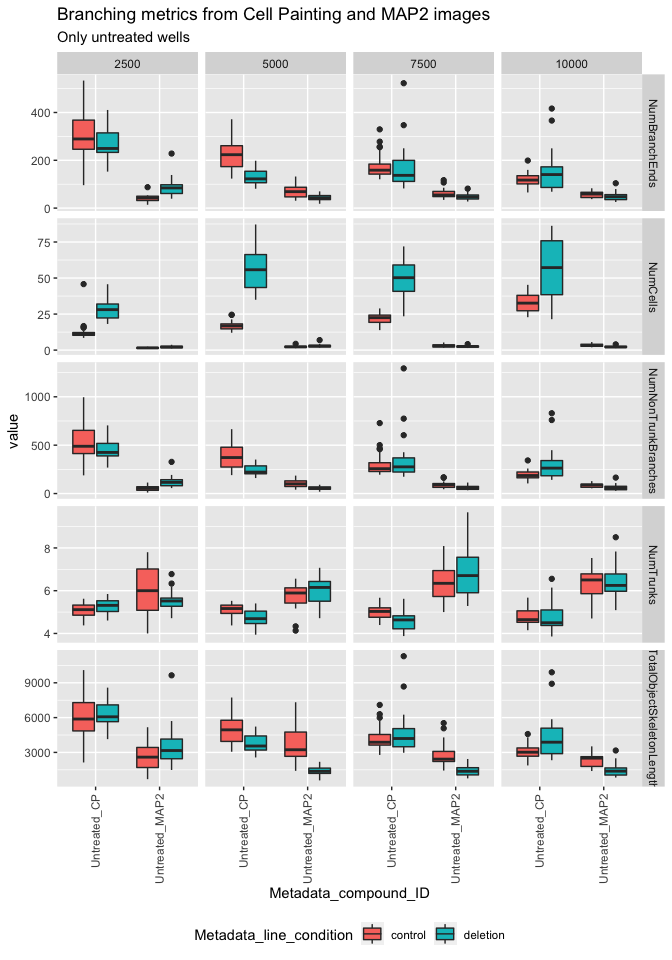

Inspect profiles
================
Shantanu Singh
June 2021

-   [1 Load libraries](#load-libraries)
-   [2 Read profiles](#read-profiles)
-   [3 Report statistics](#report-statistics)
    -   [3.1 Global](#global)
        -   [3.1.1 Counts](#counts)
        -   [3.1.2 Branching metrics](#branching-metrics)
    -   [3.2 Per condition](#per-condition)
        -   [3.2.1 Branching metrics](#branching-metrics-1)

# 1 Load libraries

``` r
library(ggplot2)
library(glue)
library(magrittr)
library(tidyverse)
```

# 2 Read profiles

``` r
batch_id <- "NCP_PILOT_3B"

platemap <- "MAtt_ICC_test"

plate_id <- "MAtt_ICC_test"

profiles_map2 <- 
  read_csv(file.path("profiles", batch_id, plate_id, paste0(plate_id, "_augmented.csv.gz")), 
           progress = FALSE)
```

``` r
batch_id <- "NCP_PILOT_3"

platemap <- "BR_NCP_PILOT_3"

plate_id <- "BR_NCP_PILOT_3"

profiles_cp <- 
  read_csv(file.path("profiles", batch_id, plate_id, paste0(plate_id, "_augmented.csv.gz")), 
           progress = FALSE)
```

``` r
shorten_skel_feature_name <- function(s) 
  s %>% 
  str_remove("Nuclei_ObjectSkeleton_") %>% 
  str_remove("_CellBodiesPlusNeuritesSkel") %>%
  str_replace("Nuclei_Number_Object_Number", "NumCells") %>%
  str_replace("Number", "Num")

get_skel_features <- function(profiles) 
  profiles %>% 
  select(matches("Metadata_|Skel$|^Nuclei_Number_Object_Number$")) %>% 
  select(-matches("_mito_skel$")) %>%
  rename_with(shorten_skel_feature_name)

count_wells <- function(profiles) 
  profiles %>% group_by(across(matches("plating_density|line_condition|compound_ID"))) %>% tally()
```

# 3 Report statistics

## 3.1 Global

### 3.1.1 Counts

Count wells per unique perturbations

``` r
count_wells(profiles_map2)
```

<div class="kable-table">

| Metadata\_plating\_density | Metadata\_line\_condition |   n |
|---------------------------:|:--------------------------|----:|
|                       2500 | control                   |  15 |
|                       2500 | deletion                  |  16 |
|                       5000 | control                   |  16 |
|                       5000 | deletion                  |  16 |
|                       7500 | control                   |  16 |
|                       7500 | deletion                  |  16 |
|                      10000 | control                   |  16 |
|                      10000 | deletion                  |  16 |

</div>

``` r
count_wells(profiles_cp)
```

<div class="kable-table">

| Metadata\_plating\_density | Metadata\_line\_condition | Metadata\_compound\_ID |   n |
|---------------------------:|:--------------------------|:-----------------------|----:|
|                       2500 | control                   | BRD-K15108141-003-04-7 |   4 |
|                       2500 | control                   | BRD-K21680192-300-14-4 |   4 |
|                       2500 | control                   | BRD-K36207157-001-09-6 |   4 |
|                       2500 | control                   | BRD-K79131256-001-17-9 |   4 |
|                       2500 | control                   | NA                     |  32 |
|                       2500 | deletion                  | BRD-K15108141-003-04-7 |   3 |
|                       2500 | deletion                  | BRD-K21680192-300-14-4 |   4 |
|                       2500 | deletion                  | BRD-K36207157-001-09-6 |   4 |
|                       2500 | deletion                  | BRD-K79131256-001-17-9 |   4 |
|                       2500 | deletion                  | NA                     |  33 |
|                       5000 | control                   | BRD-K15108141-003-04-7 |   4 |
|                       5000 | control                   | BRD-K21680192-300-14-4 |   4 |
|                       5000 | control                   | BRD-K36207157-001-09-6 |   4 |
|                       5000 | control                   | BRD-K79131256-001-17-9 |   4 |
|                       5000 | control                   | NA                     |  32 |
|                       5000 | deletion                  | BRD-K15108141-003-04-7 |   4 |
|                       5000 | deletion                  | BRD-K21680192-300-14-4 |   4 |
|                       5000 | deletion                  | BRD-K36207157-001-09-6 |   4 |
|                       5000 | deletion                  | BRD-K79131256-001-17-9 |   4 |
|                       5000 | deletion                  | NA                     |  32 |
|                       7500 | control                   | BRD-K15108141-003-04-7 |   4 |
|                       7500 | control                   | BRD-K21680192-300-14-4 |   4 |
|                       7500 | control                   | BRD-K36207157-001-09-6 |   4 |
|                       7500 | control                   | BRD-K79131256-001-17-9 |   4 |
|                       7500 | control                   | NA                     |  32 |
|                       7500 | deletion                  | BRD-K15108141-003-04-7 |   4 |
|                       7500 | deletion                  | BRD-K21680192-300-14-4 |   4 |
|                       7500 | deletion                  | BRD-K36207157-001-09-6 |   4 |
|                       7500 | deletion                  | BRD-K79131256-001-17-9 |   4 |
|                       7500 | deletion                  | NA                     |  32 |
|                      10000 | control                   | BRD-K15108141-003-04-7 |   4 |
|                      10000 | control                   | BRD-K21680192-300-14-4 |   4 |
|                      10000 | control                   | BRD-K36207157-001-09-6 |   4 |
|                      10000 | control                   | BRD-K79131256-001-17-9 |   4 |
|                      10000 | control                   | NA                     |  32 |
|                      10000 | deletion                  | BRD-K15108141-003-04-7 |   4 |
|                      10000 | deletion                  | BRD-K21680192-300-14-4 |   4 |
|                      10000 | deletion                  | BRD-K36207157-001-09-6 |   4 |
|                      10000 | deletion                  | BRD-K79131256-001-17-9 |   4 |
|                      10000 | deletion                  | NA                     |  32 |

</div>

### 3.1.2 Branching metrics

Get branching metrics

From
<http://cellprofiler-manual.s3.amazonaws.com/CellProfiler-3.0.0/modules/measurement.html#measureobjectskeleton>

-   `NumberTrunks`: The number of trunks. Trunks are branchpoints that
    lie within the seed objects
-   `NumberNonTrunkBranches`: The number of non-trunk branches. Branches
    are the branchpoints that lie outside the seed objects.
-   `NumberBranchEnds`: The number of branch end-points, i.e, termini.
-   `TotalObjectSkeletonLength`: The length of all skeleton segments per
    object.

``` r
skel_map2 <- get_skel_features(profiles_map2)

skel_cp <- get_skel_features(profiles_cp)
```

Plot these features

``` r
skel_map2 %>%
  pivot_longer(-matches("Metadata")) %>%
  ggplot(aes(value)) + geom_histogram(bins = 50) + facet_wrap(~name, scales = "free")
```

<!-- -->

``` r
skel_cp %>%
  pivot_longer(-matches("Metadata")) %>%
  ggplot(aes(value)) + geom_histogram(bins = 50) + facet_wrap(~name, scales = "free")
```

<!-- -->

``` r
variables <- names(skel_cp) %>% str_subset("Metadata_", negate = TRUE)
skel_cp %>% 
  cytominer::mark_outlier_rows(variables, skel_cp) %>% 
  filter(!is_outlier) %>%
  select(-is_outlier) %>%
  pivot_longer(-matches("Metadata")) %>%
  ggplot(aes(value)) + geom_histogram(bins = 50) + facet_wrap(~name, scales = "free")
```

<!-- -->

``` r
skel_cp <- 
  skel_cp %>% 
  cytominer::mark_outlier_rows(variables, skel_cp) %>% 
  filter(!is_outlier) %>%
  select(-is_outlier) 

skel_cp %>%
  count()
```

<div class="kable-table">

|   n |
|----:|
| 374 |

</div>

## 3.2 Per condition

### 3.2.1 Branching metrics

``` r
skel_map2 %>%
  pivot_longer(-matches("Metadata")) %>%
  ggplot(aes(Metadata_line_condition, value)) + geom_boxplot() + 
  facet_grid(name~Metadata_plating_density, scales = "free")
```

<!-- -->

``` r
skel_cp %>%
  pivot_longer(-matches("Metadata")) %>%
  ggplot(aes(Metadata_compound_ID, value, fill=Metadata_line_condition)) + 
  geom_boxplot() + 
  facet_grid(name~Metadata_plating_density, scales = "free") + 
  theme(axis.text.x = element_text(angle = 90, vjust = 0.5, hjust=1)) +
  theme(legend.position="bottom")
```

<!-- -->

``` r
skel_cp <- 
  skel_cp %>% 
  select(
    any_of(c("Metadata_plating_density", "Metadata_line_condition", "Metadata_compound_ID")), 
    all_of(variables)) %>%
  mutate(Metadata_compound_ID = replace_na(Metadata_compound_ID, "Untreated_CP"))

skel_map2 <- 
  skel_map2 %>% 
  select(
    any_of(c("Metadata_plating_density", "Metadata_line_condition", "Metadata_compound_ID")), 
    all_of(variables)) %>%
  mutate(Metadata_compound_ID = "Untreated_MAP2") %>%
  select(matches("Metadata"), everything())
```

``` r
skel <-
  bind_rows(skel_cp, skel_map2)
```

``` r
skel %>%
  pivot_longer(-matches("Metadata")) %>%
  ggplot(aes(Metadata_compound_ID, value, fill=Metadata_line_condition)) + 
  geom_boxplot() + 
  facet_grid(name~Metadata_plating_density, scales = "free") + 
  theme(axis.text.x = element_text(angle = 90, vjust = 0.5, hjust=1)) +
  theme(legend.position="bottom") +
  ggtitle("Branching metrics from Cell Painting and MAP2 images", 
          subtitle = "All compounds are from Cell Painting images")
```

<!-- -->

``` r
skel %>%
  pivot_longer(-matches("Metadata")) %>%
  filter(str_detect(Metadata_compound_ID, "Untreated")) %>%
  ggplot(aes(Metadata_compound_ID, value, fill=Metadata_line_condition)) + 
  geom_boxplot() + 
  facet_grid(name~Metadata_plating_density, scales = "free") + 
  theme(axis.text.x = element_text(angle = 90, vjust = 0.5, hjust=1)) +
  theme(legend.position="bottom") +
  ggtitle("Branching metrics from Cell Painting and MAP2 images", 
          subtitle = "Only untreated wells")
```

<!-- -->

``` r
skel %>%
  pivot_longer(-matches("Metadata")) %>%
  filter(str_detect(Metadata_compound_ID, "Untreated")) %>%
  ggplot(aes(as.factor(Metadata_plating_density), value, fill=Metadata_compound_ID)) + 
  geom_boxplot() + 
  facet_grid(name~Metadata_line_condition, scales = "free") + 
  theme(axis.text.x = element_text(angle = 90, vjust = 0.5, hjust=1)) +
  theme(legend.position="bottom") +
  ggtitle("Branching metrics from Cell Painting and MAP2 images", 
          subtitle = "Only untreated wells")
```

<!-- -->

``` r
skel %>%
  filter(str_detect(Metadata_compound_ID, "Untreated")) %>%
  ggplot(aes(NumNonTrunkBranches, NumBranchEnds, color = Metadata_compound_ID)) + 
  geom_point() + 
  geom_abline(slope = 1, alpha = 0.5) +
  facet_grid(Metadata_plating_density ~ Metadata_compound_ID + Metadata_line_condition) + 
  theme(axis.text.x = element_text(angle = 90, vjust = 0.5, hjust=1)) +
  theme(legend.position="bottom") +
  coord_equal() +
  ggtitle("Branch ends vs Non-trunck branches from Cell Painting and MAP2 images", 
          subtitle = "Only untreated wells")
```

<!-- -->
